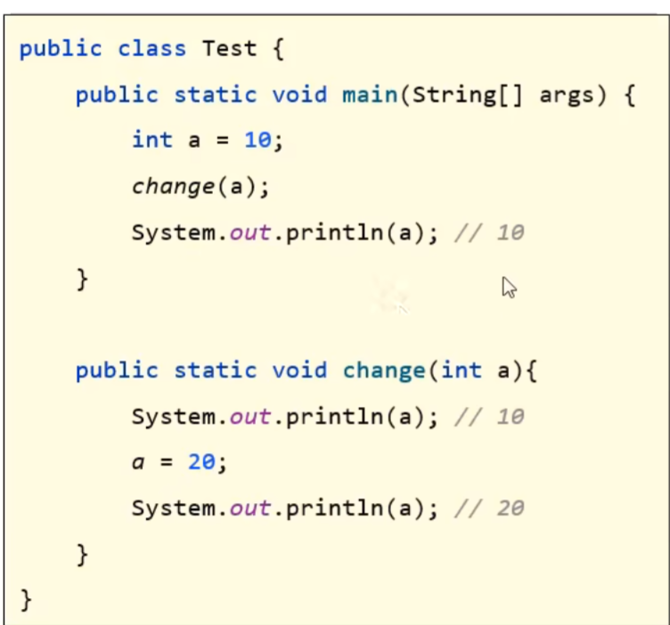

# JAVA参数传递机制

> **引用数据类型一般存储在堆内存中，基本数据类型一般存储在栈内存中** 

## 基本类型的参数传递

1. 值传递：    
>在传递时，实参复制一个副本给传递给形参，形参的改变不影响实参
2. 实参： 在方法内部定义的变量
3. 形参： 以方法为例，就是方法定义时的变量

如下图程序：

>在change方法中，a从10改变为20，但是不影响main主方法中a的值

## 引用类型的参数传递

也为**值传递**，但是引用类型传递的时实参中存储的**地址**的副本
