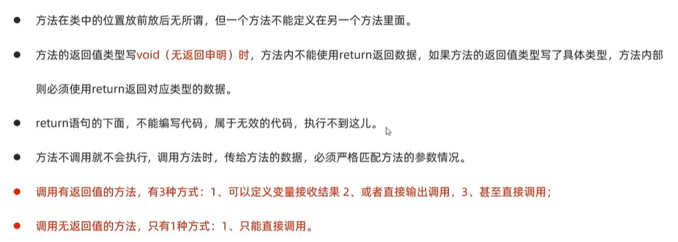
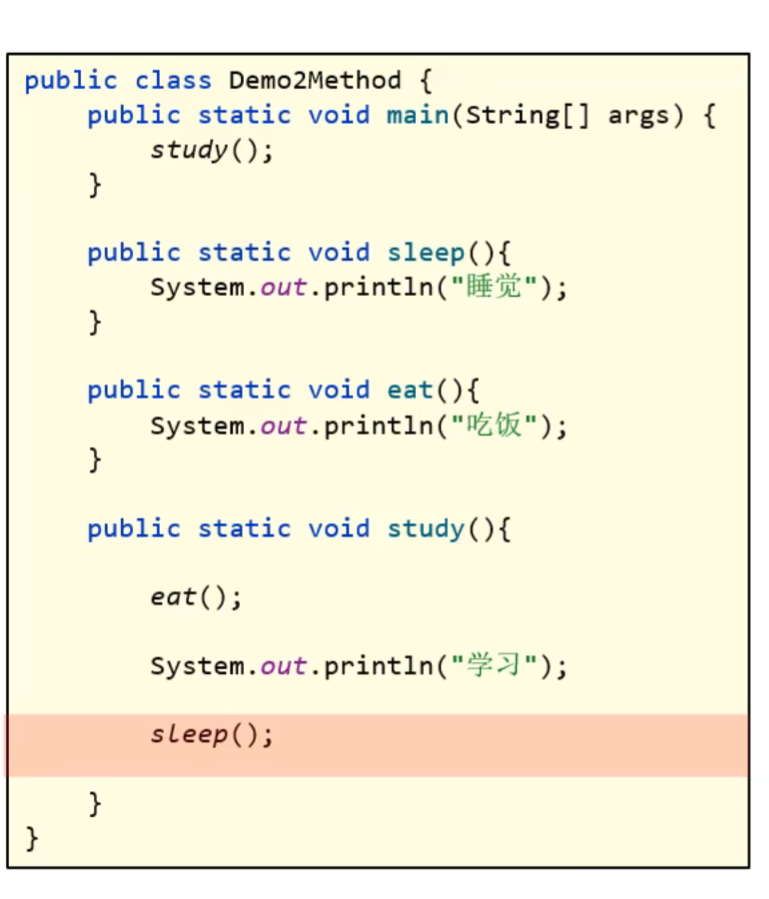
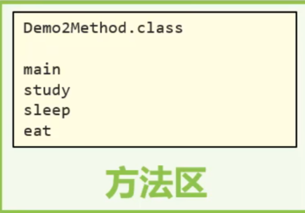
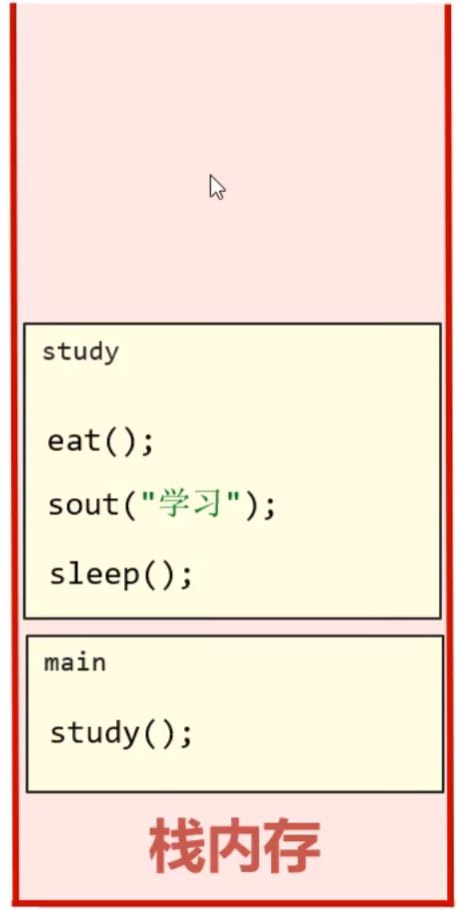
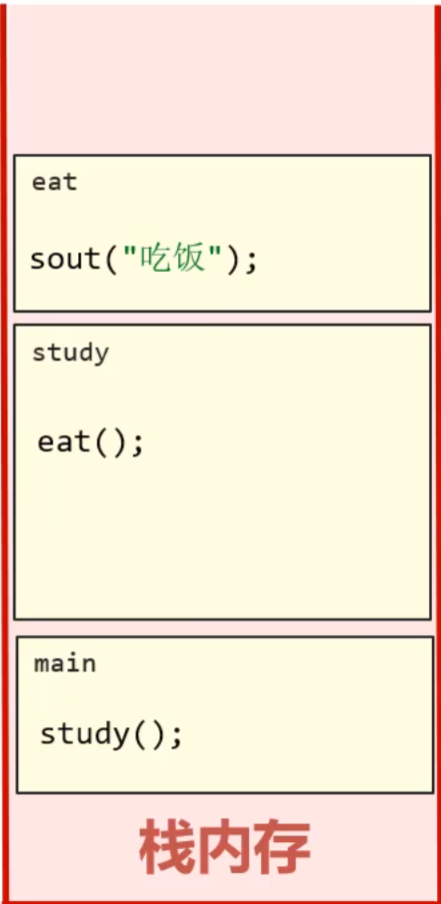
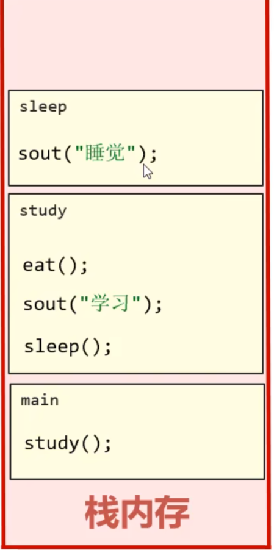
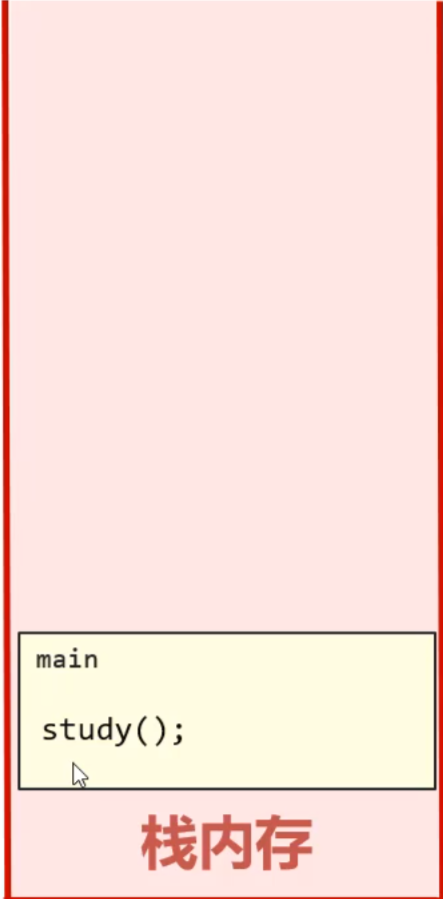

# Java方法

## 方法使用（面试）


## 方法在计算机中的执行原理

1. .class文件以及所有方法（包括main方法）首先存储在方法区中
2. 在栈内存中运行所有方法
>因为栈有 **先进后出** 的特点

如下列代码：



此时在方法区中：



此时在栈内存中：
1. 最先调用main方法，因此main方法先进入栈内存，并存入在栈的最底下
   
2. 接着调用study方法，因此study方法进栈



3. study方法中有eat方法和sleep方法，首先调用eat方法，因此eat方法先进栈。执行完eat方法后，eat方法将先出栈



4. 接着执行sleep方法，sleep方法进栈，执行完sleep方法后将其出栈。



5. 执行完study方法后，study方法将出栈，最后剩main方法



6. 最后main方法执行完毕，main方法出栈，到此全部方法出栈

## 方法重载

一个类中，**只要一些方法的名称相同、形参列表不同**，那么他们就是方法重载了，其他的都不管（如：修饰符，返回值类型是否一样都无所谓）

如下列代码：

```java
public static void test(int a){}

void test(double a){}

void test(double a, int a){}
```
都算是方法重载

>形参列表不同指的是：形参的**个数、类型、顺序**不同，不关心形参的名称（**因为在方法的形参中，形参名字只是在该方法中有用，故名字不重要**）

如下列代码：
```java
void test(int b, double a){}

void test(int a, double b){}
```
则会报错，因为test已经有形如(int , double)的形参了，不关心形参的名称，但是顺序、个数、类型不能一样。


## return关键字在方法中的单独使用

可以用在**无返回值**的方法中，作用是：立即跳出并结束当前方法