# File和IO流

File：代表文本

IO流：读写数据

## File

### 创建File类的对象

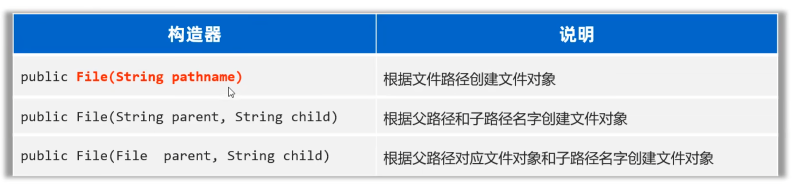

#### 绝对路径，相对路径

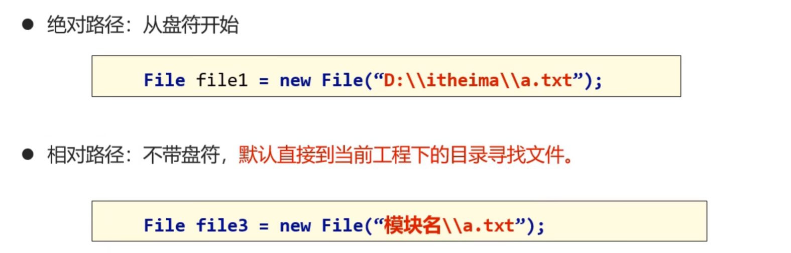

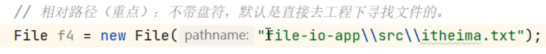

不带盘符可使得程序在不同电脑上运行时，不会找不到路径

使用如下方法创建对象：

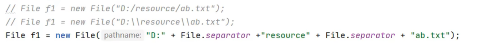

可提高扩展性，（在不同平台都可使用）

### 常用方法1：判断文件类型、获取文件信息

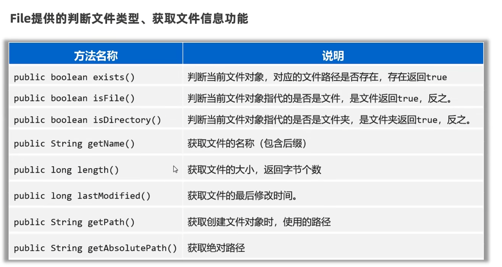

### 常用方法2： 创建文件、删除文件

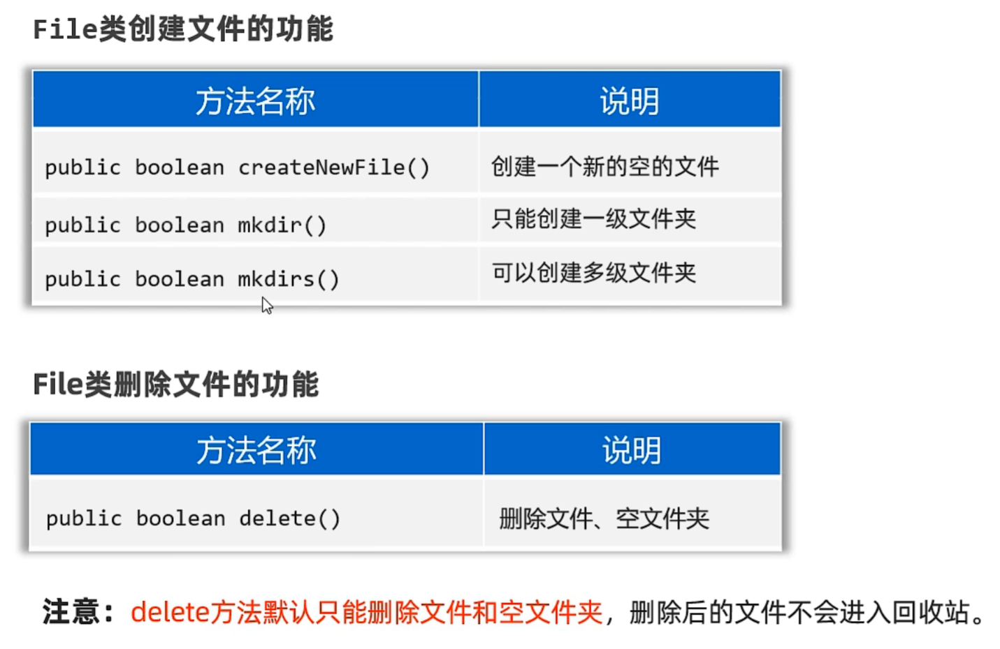

### 常用方法3：遍历文件夹

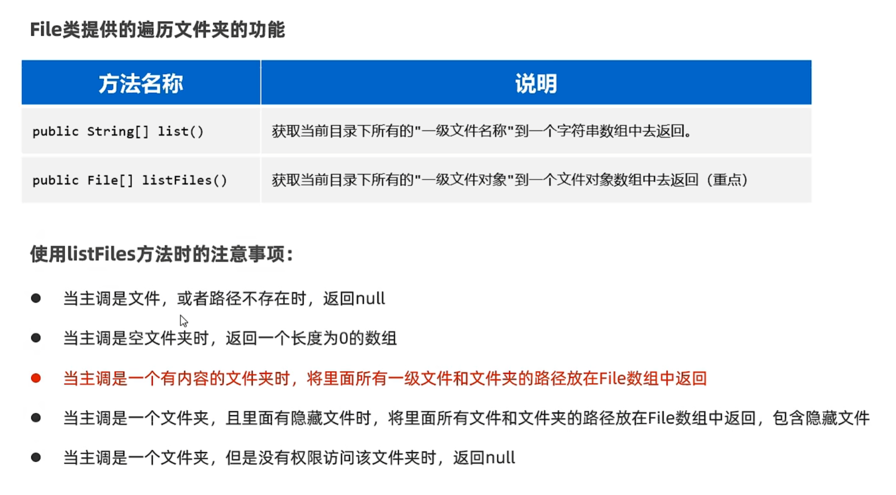

### 文件搜索

使用文件搜索寻找QQ.exe文件：

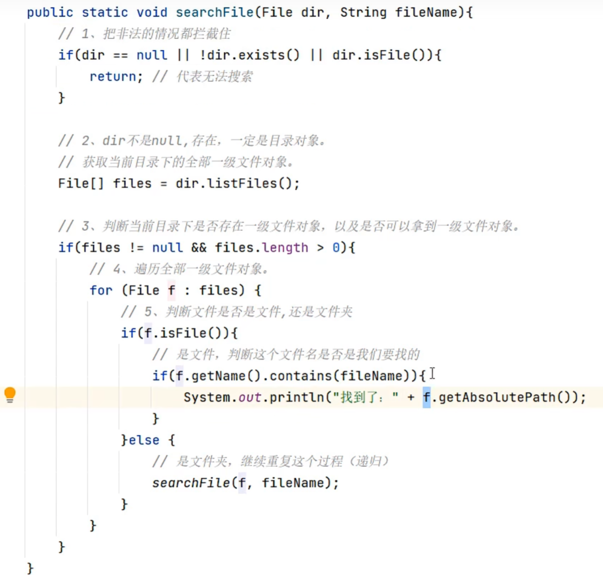

## IO流

### 字符集

#### UTF-8

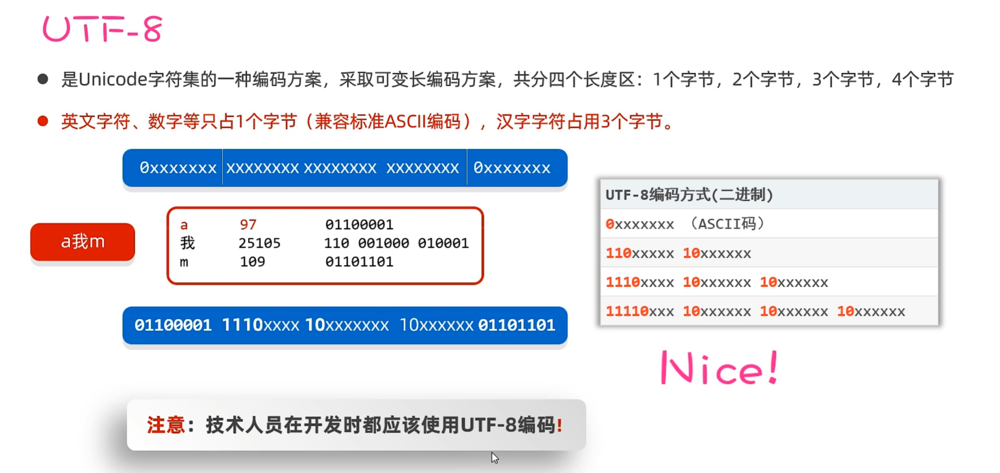

#### 编码和解码

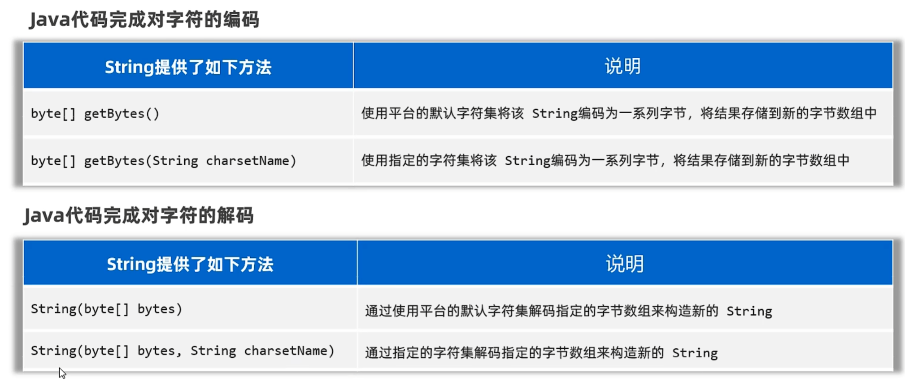

### IO流体系

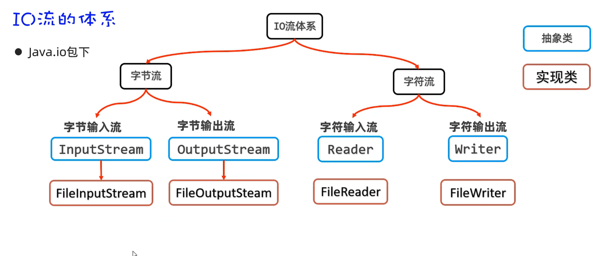

### FileInputStream

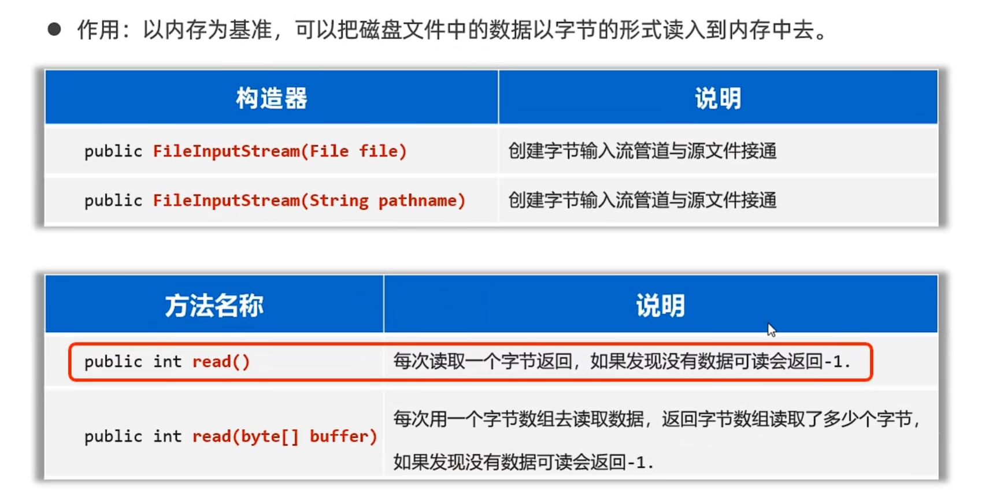

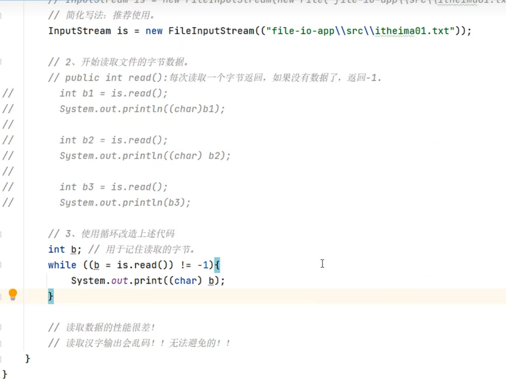

>结尾一定要释放系统资源：is.close();

>FileInputStream每次读取多个字节，读取性能得到了提示，但是读取汉字输出还是会乱码

### 文件字节输入流

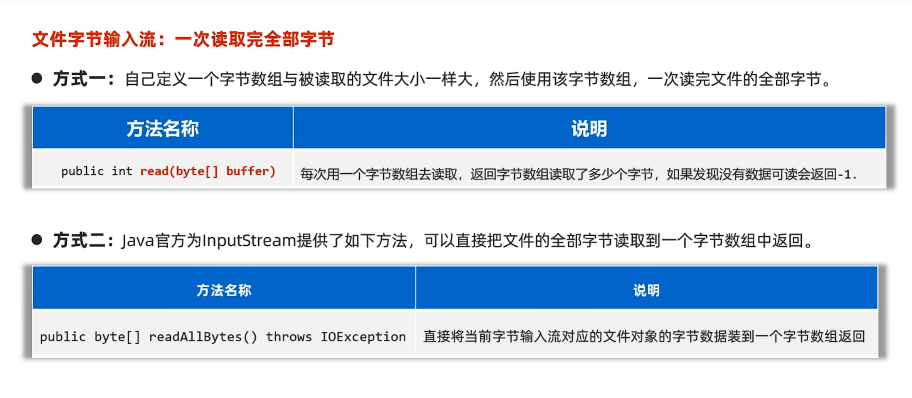

### FileOutputStream

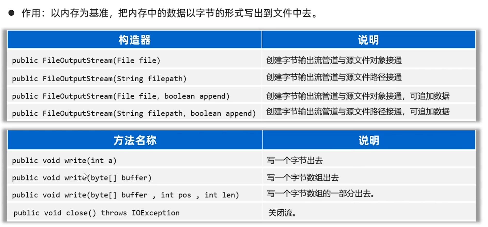

### 释放资源的方式

#### try-catch-finally

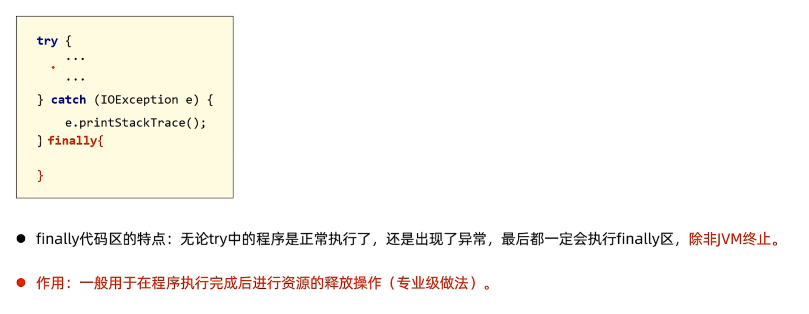

