# Lambda

## Arrays

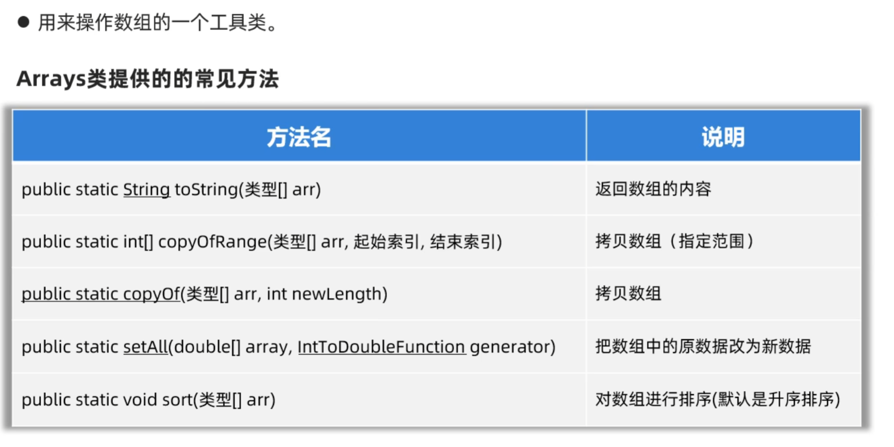

### 当数组中存储的是对象，将如何排序？

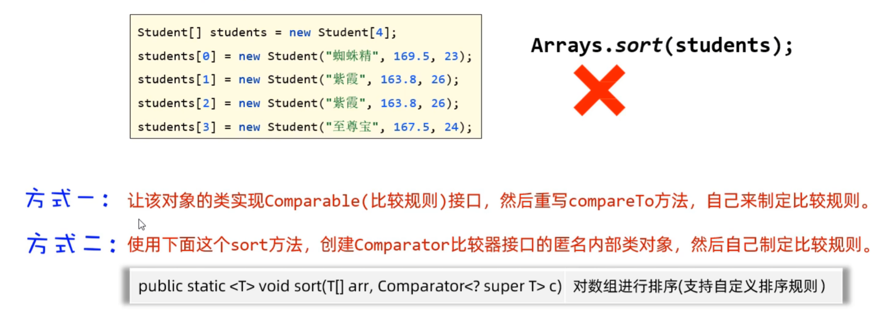

#### 第一种方式

重写的方法：

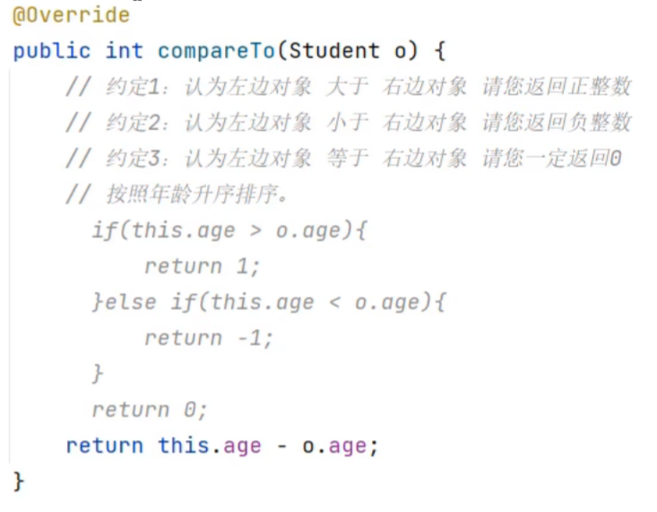

#### 第二种方式

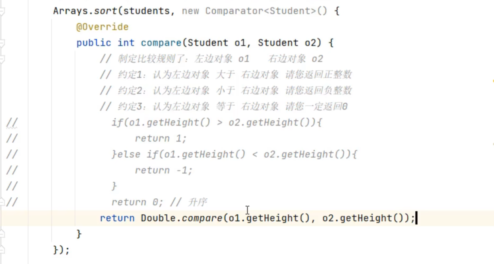

## Lambda表达式

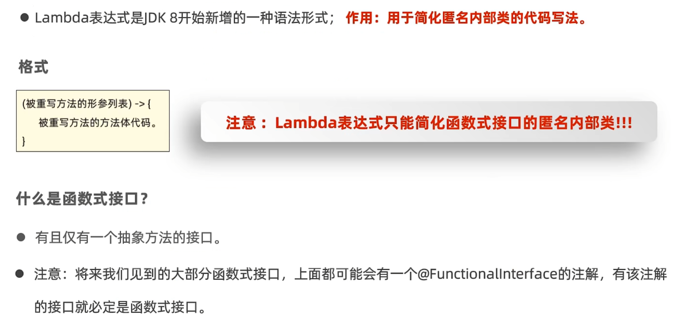

可被简化的代码：


不可被简化的代码：

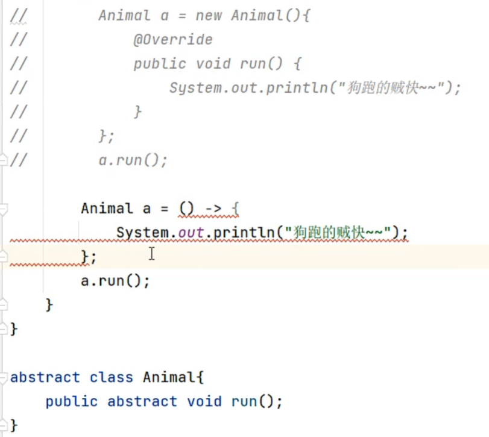

简化实例：

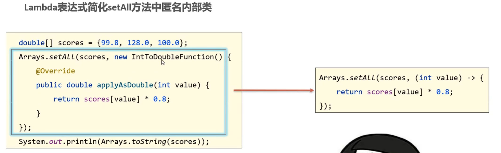

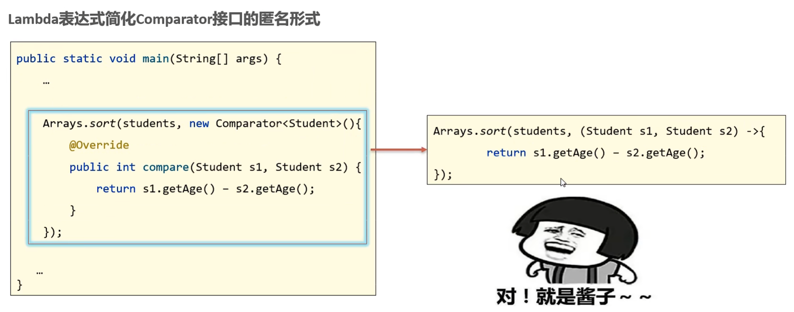

### 省略写法

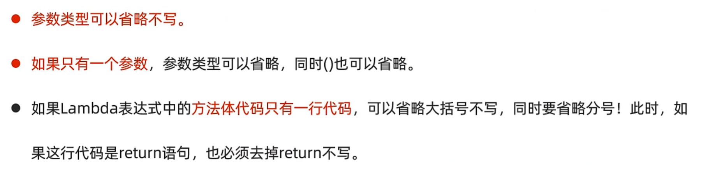

初始代码：

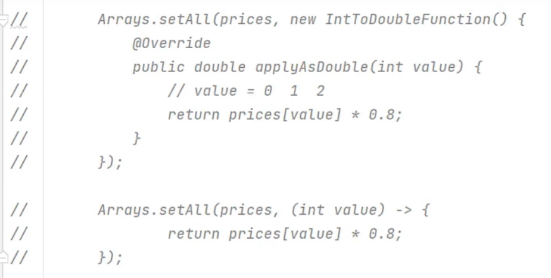

省略参数类型：


省略括号：

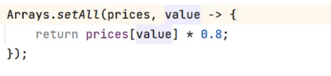

最简化版本：

```java
Arrays.setAll(prices, value -> prices[value] * 0.8);
```
