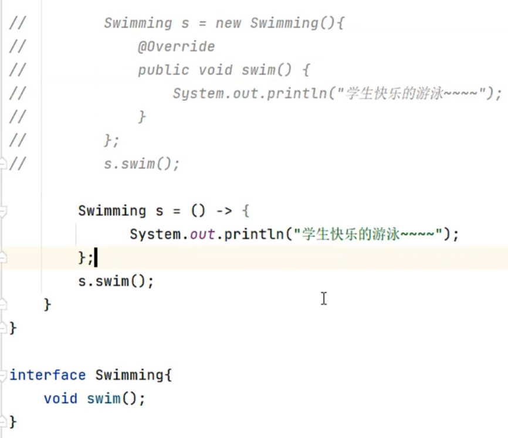
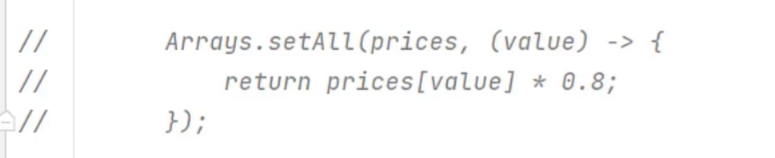

# Lambda

## Arrays


### 当数组中存储的是对象，将如何排序？


#### 第一种方式

重写的方法：


#### 第二种方式


## Lambda表达式


可被简化的代码：



不可被简化的代码：


简化实例：


### 省略写法


初始代码：


省略参数类型：



省略括号：


最简化版本：

```java
Arrays.setAll(prices, value -> prices[value] * 0.8);
```
