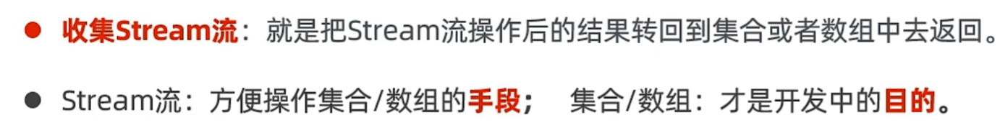

# Stream流

## 使用步骤

## 获取Stream流

### 获取List集合的Stream流

### 获取Set集合的Stream流

### 获取Map集合的Stream流

### 获取数组的Stream流

## Stream流常见中间方法

中间方法是指调用完成后会返回新的Stream流，可以继续使用（支持链式编程）

## Stream流的终结方法
 

### 存入到Map集合中

