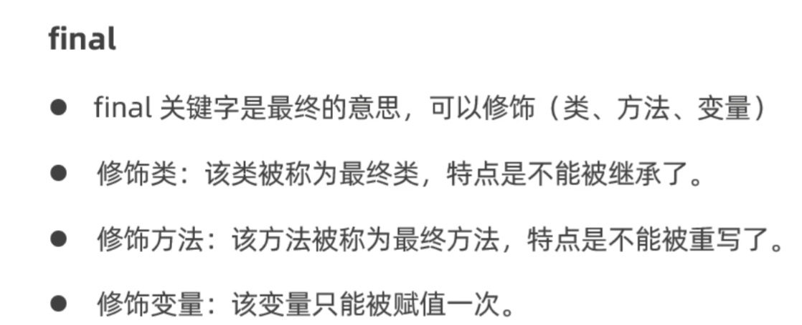
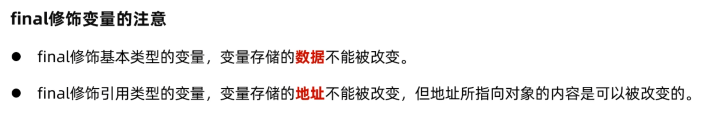
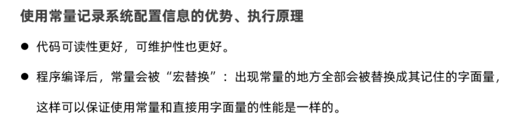

# final和常量

## final



变量分为：

* 局部变量
* 成员变量
  * 静态成员变量
  * 实例成员变量

局部变量可能的使用：

```java
public static void buy(final double z){
    //z = 0;
}
```

此时在buy方法内部，z无法被再次修改

>因此final可用于传入方法中的局部变量，但是不想此变量在方法中被修改



## 常量

* static final修饰的成员变量
* 通常用于记录系统的配置信息

>建议名称全部大写，多个单词下划线连接

