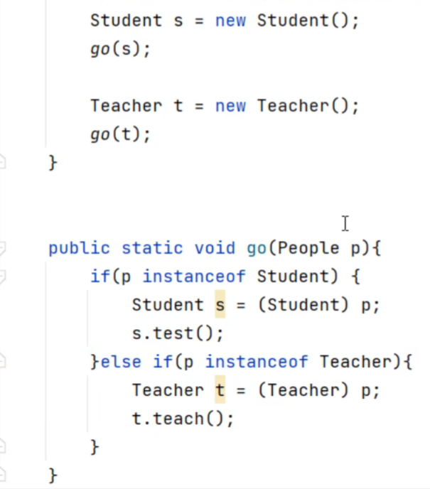

# 多态


多态是在**继承/实现**情况下的一种现象，表现为：对象多态、行为多态


* 对象多态：People的对象既可以是Studen，也可以是Teacher
* 行为多态：不同的对象可以调用相同的方法，且结果不同（因为在子类中重写了方法）

## 多态的前提

* 有继承/实现关系（没有继承就不要谈多态）
* 存在父类引用子类对象
* 存在方法重写（不重写方法，子类就没有存在的必要）

>People的范围大于Studen和Teacher（因为People是父类），因此可以使用多态

## 多态的注意事项

多态是对象、行为的多态，Java中你的属性（成员变量）不谈多态


上述代码的输出都为People中的name属性，不会因为Teacher和Studen改变

## 使用多态的好处

* 在多态形式下，右边对象时解耦合的，便于扩展和维护

```java
People p1 = new Teacher();//new Student()
p1.run();
```

当需要对代码进行调整时，可以直接将Teacher换成Studen，后面各种方法和调用都不需要改变，这就是解耦合

* 定义方法时，使用父类类型的形参，可以接收一切子类对象，扩展性更强、更便利


go类的形参直接定位父类People，此时子类s类和t类都可以直接接收

>但是多态下不能使用子类独有的功能，只能使用重写的方法

## 使用多态的好处（补）

如上述代码，使用多态后，p1只能使用重写后的run方法，不能使用Teacher类特有的方法

## 多态下的类型转换


```java
People p = new Teacher();
Teacher t = (Teacher)p;
```

此时t就可以直接使用子类独有的功能

### instanceof
然而若类型转换异常，即上述代码改成：

```java
People p = new Teacher();
Student t = (Student)p;
```
此时运行会报错

Java建议强转前使用instanceof关键字，判断当前对象的真实类型，再进行强转



当使用父类对象作为形参时，且在类中需要使用子类的独有方法，可通过instanceof关键字判断接收的对象是否符合强转类型