# 常用API

## Objects

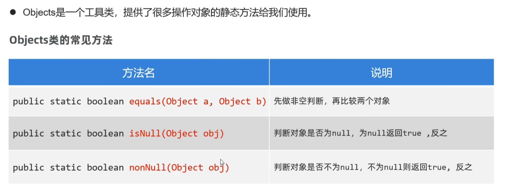

### 使用Objects.equals的好处

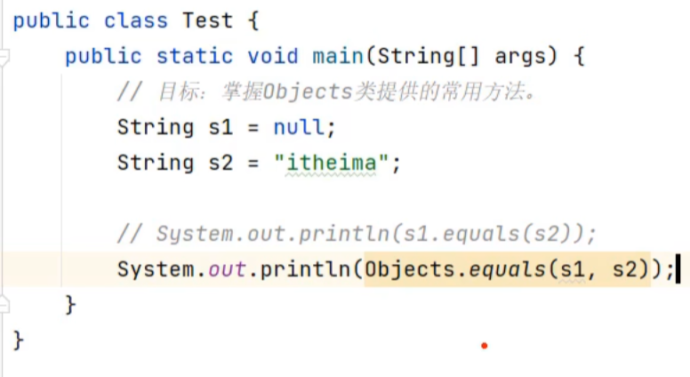

可见使用s1.equals(s2)时，当其中一个对象为null时，将会报错

## 包装类

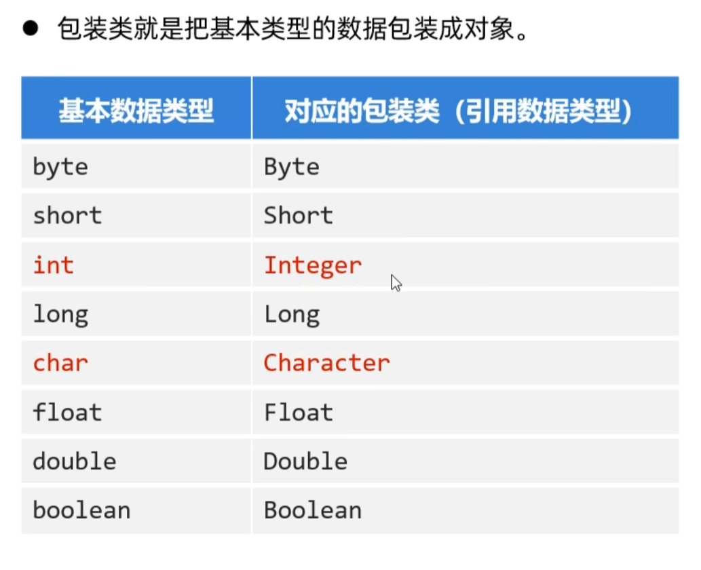

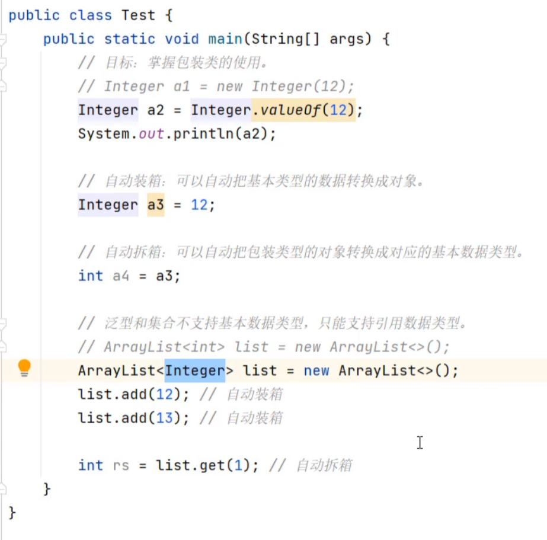

### 其它常见操作

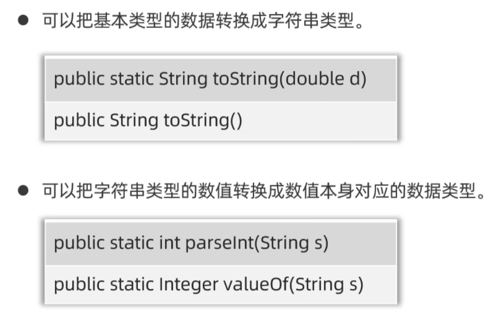

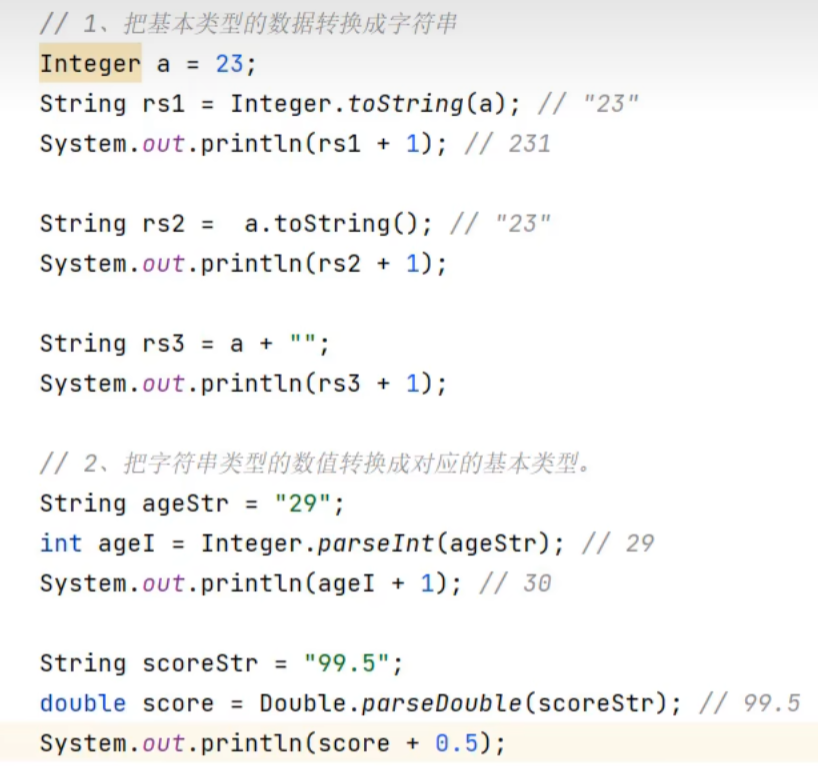

也可以直接使用valueOf

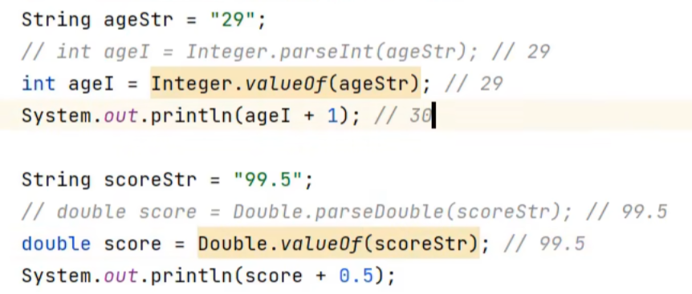

## StringBulider和StringBuffer

### StringBulider

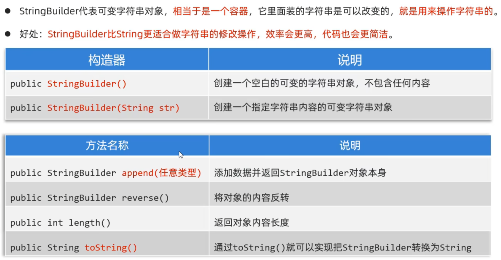

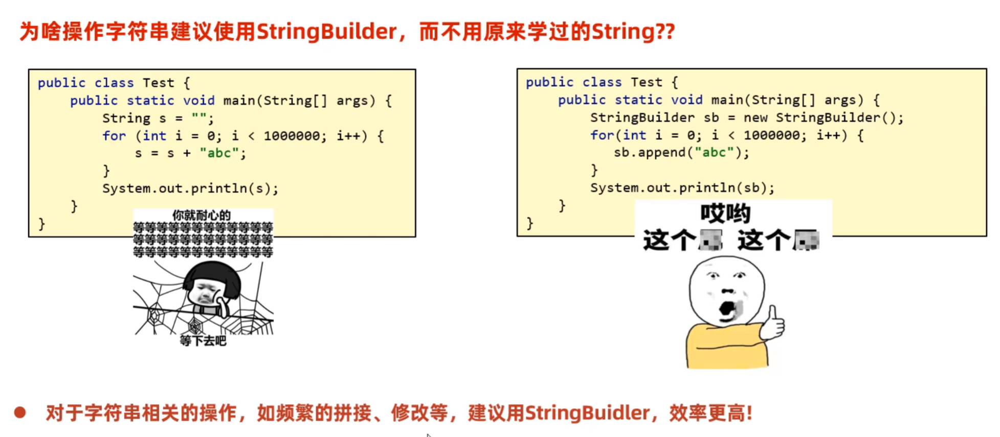

### StringBuffer

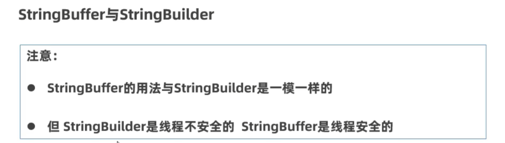

## StringJoiner

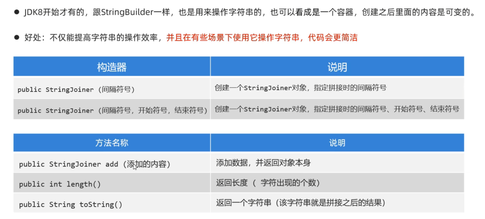

## Math

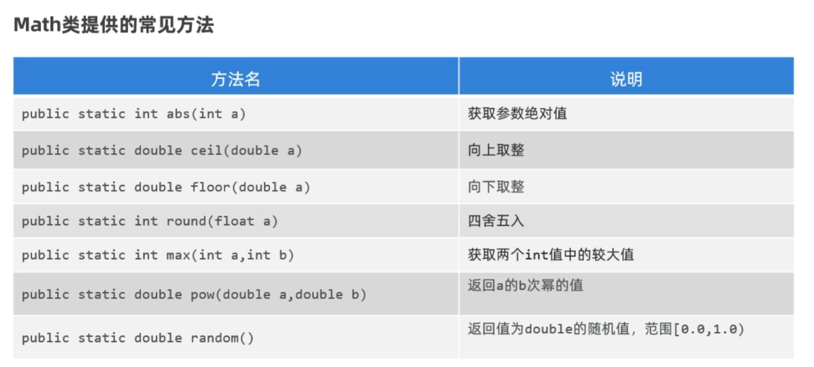

## System

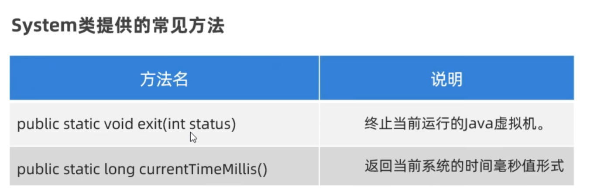

## Runtime

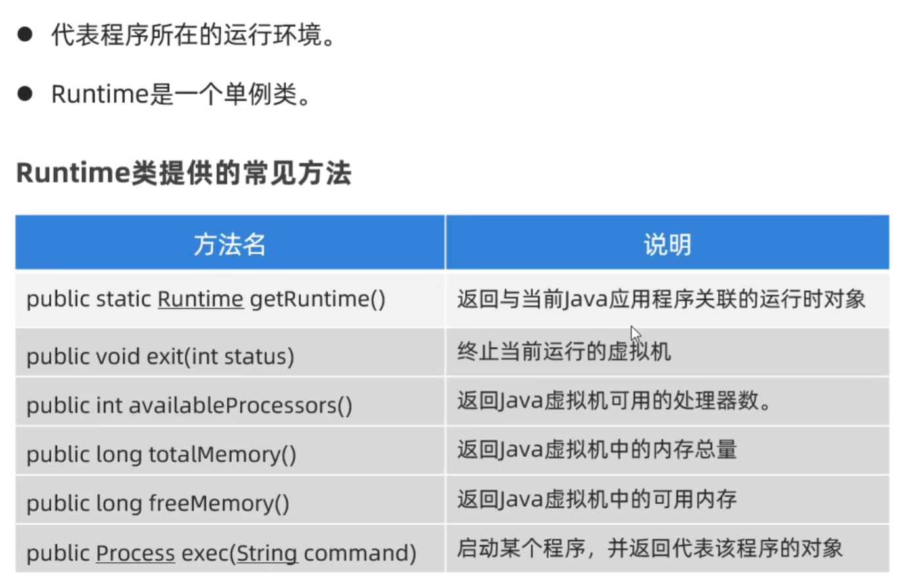

## BigDecimal

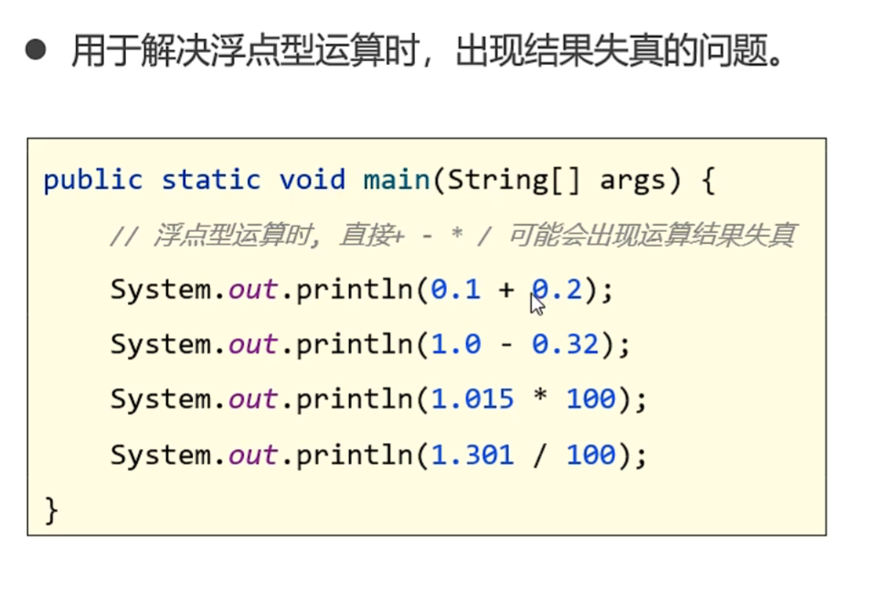

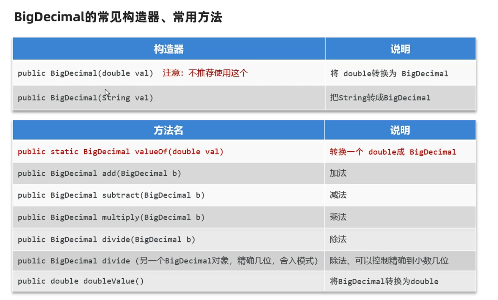

推荐使用

```java
Double a = 0.01;
BigDecimal a = BigDecimal.valueOf(a);
```
将a转换为BigDecimal型数据

### 注意事项

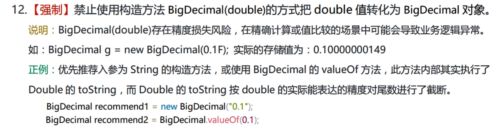


