# 常用API

## Objects

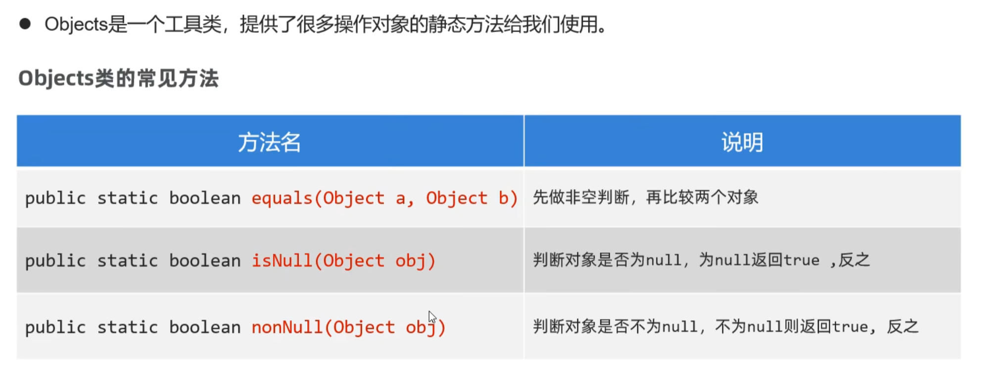

### 使用Objects.equals的好处

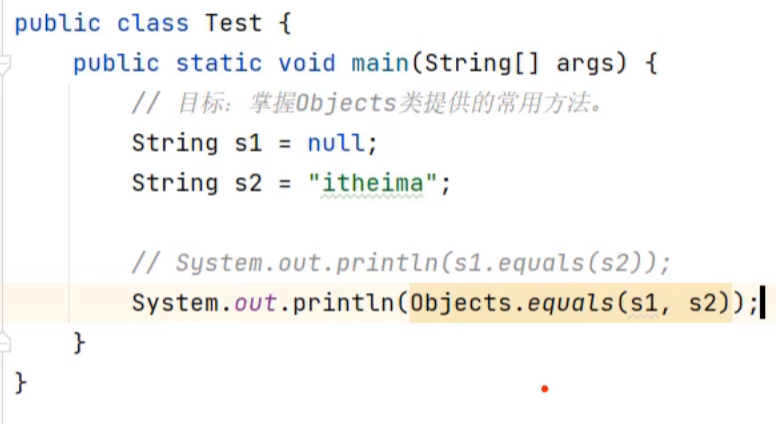

可见使用s1.equals(s2)时，当其中一个对象为null时，将会报错

>equals():可以通过重写equals方法从而比较对象的内容是否相同，如果不重写那么和==符号没有区别，都是比较的对象的引用是否指向同一个对象

## 包装类

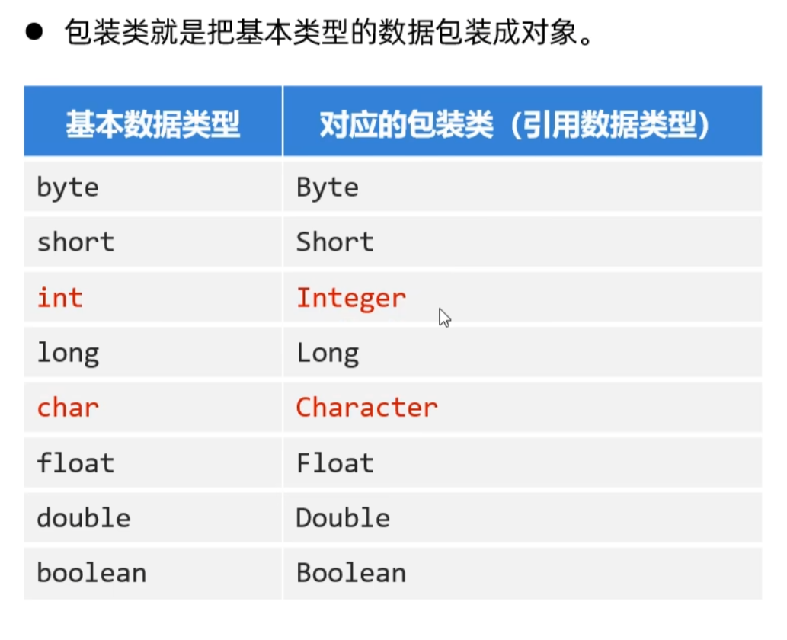

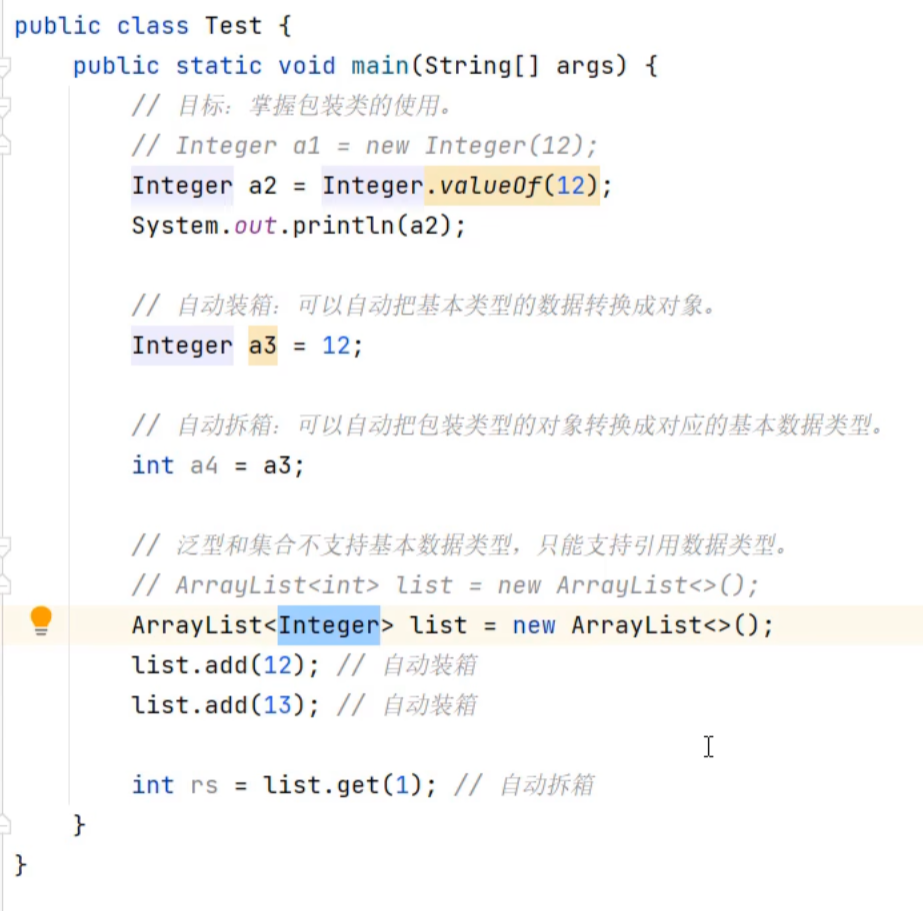


总结：

一、为什么使用包装类？

a、作为 和基本数据类型对应的类 类型存在，方便涉及到对象的操作。
b、包含每种基本数据类型的相关属性如最大值、最小值等，以及相关的操作方法。

包装类可以完成自动拆箱装箱，将基本类型的数据转换为引用类型数据，为装箱。反之则为拆箱

二、包装类与基本数据的不同之处
1、在Java中，一切皆对象，但八大基本类型却不是对象。

2、声明方式的不同，基本类型无需通过new关键字来创建，而封装类型需new关键字。

3、存储方式及位置的不同，基本类型是直接存储变量的值保存在堆栈中能高效的存取，封装类型需要通过引用指向实例，具体的实例保存在堆中。

4、初始值的不同，封装类型的初始值为null，基本类型的的初始值视具体的类型而定，比如int类型的初始值为0，boolean类型为false；

5、使用方式的不同，比如与集合类合作使用时只能使用包装类型。

6、什么时候该用包装类，什么时候用基本类型，看基本的业务来定：这个字段允不允许null值，如果允许null值，则必然要用封装类，否则值类型就可以了，用到比如泛型和反射调用函数.，就需要用包装类！ 
                        
原文链接：https://blog.csdn.net/m0_62968763/article/details/127272199

### 其它常见操作

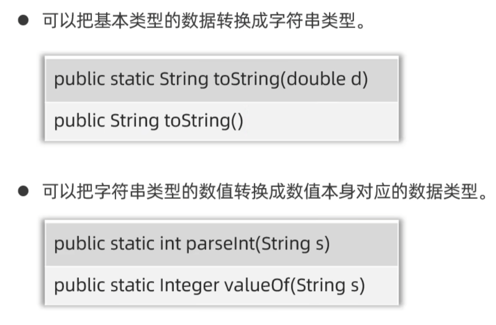

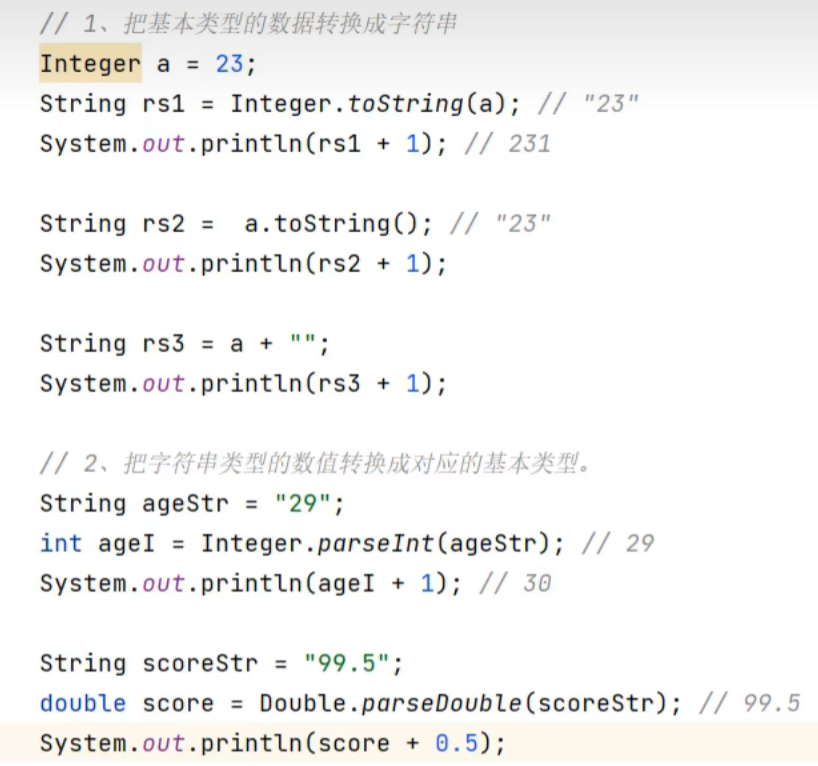

也可以直接使用valueOf

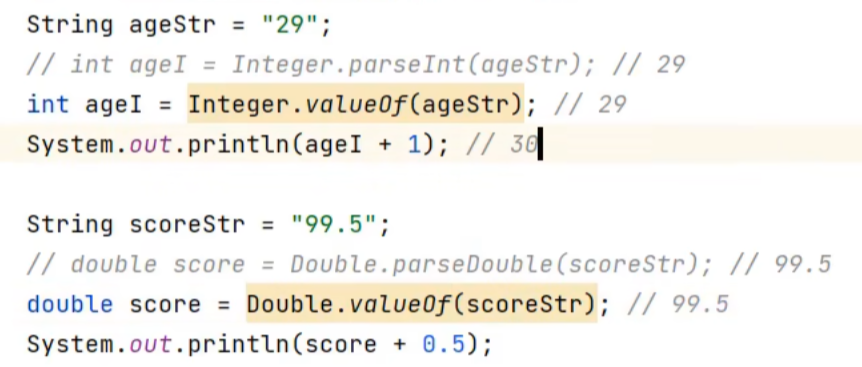

## StringBulider和StringBuffer

### StringBulider

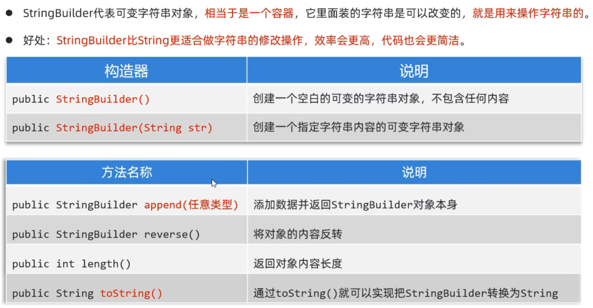

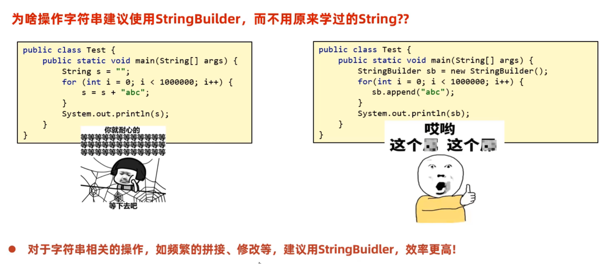

### StringBuffer

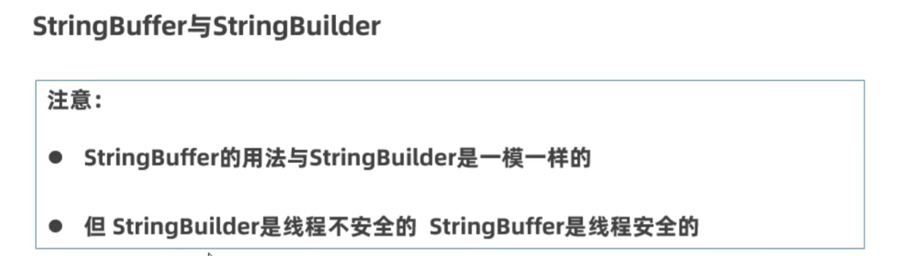

## StringJoiner

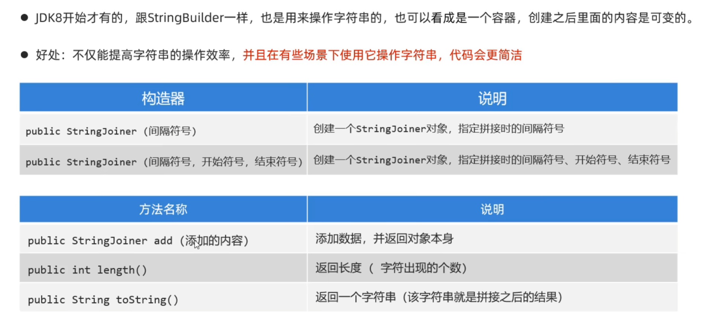

## Math

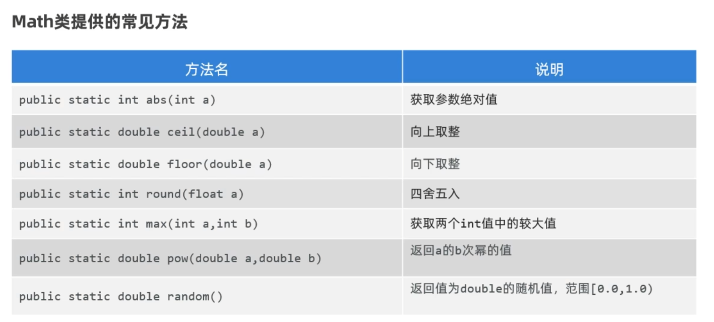

## System

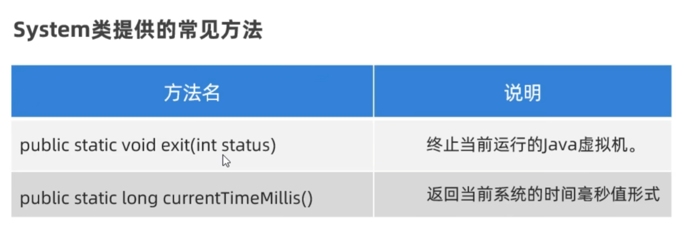

## Runtime

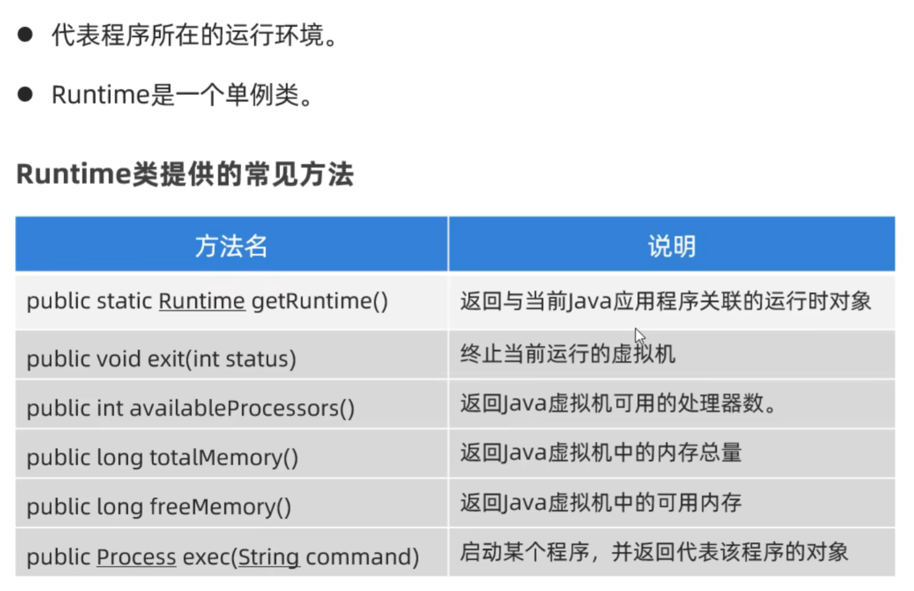

## BigDecimal

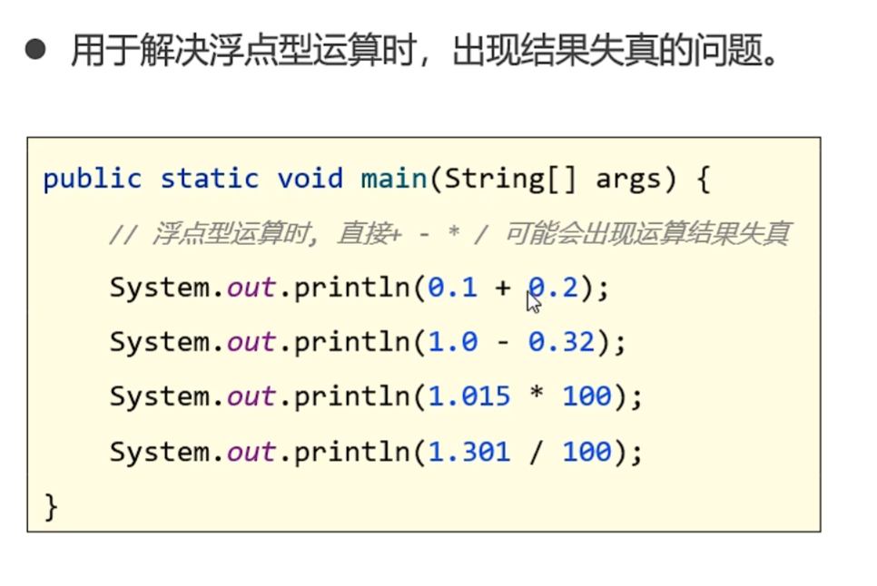

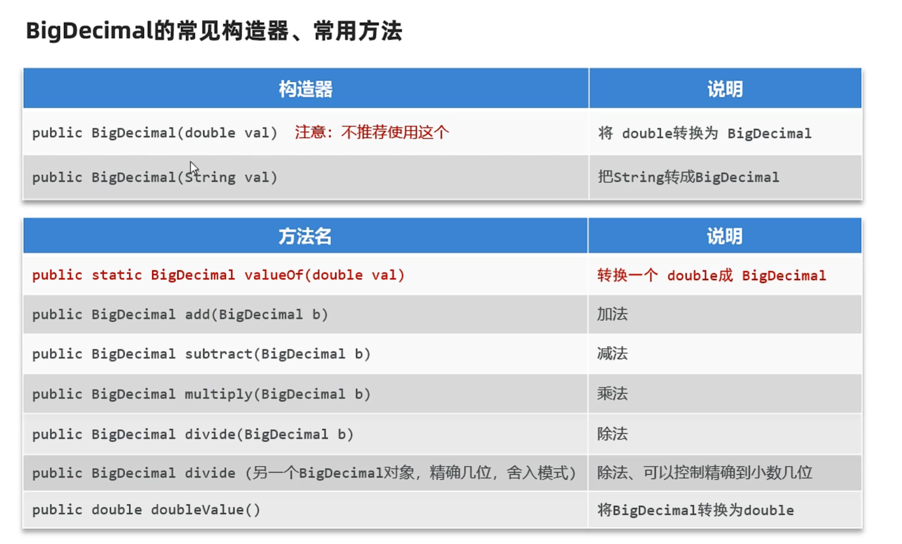

推荐使用

```java
Double a = 0.01;
BigDecimal a = BigDecimal.valueOf(a);
```
将a转换为BigDecimal型数据

### 注意事项

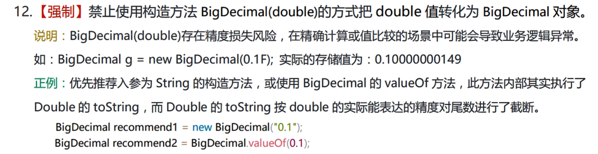


