# 常用API2

## Date

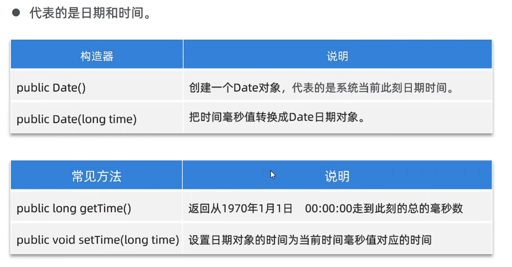

## SimpleDateFormat

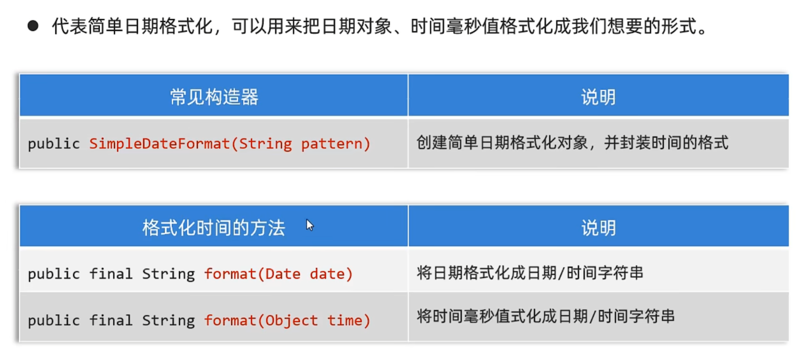

### 解析字符串时间成为日期对象

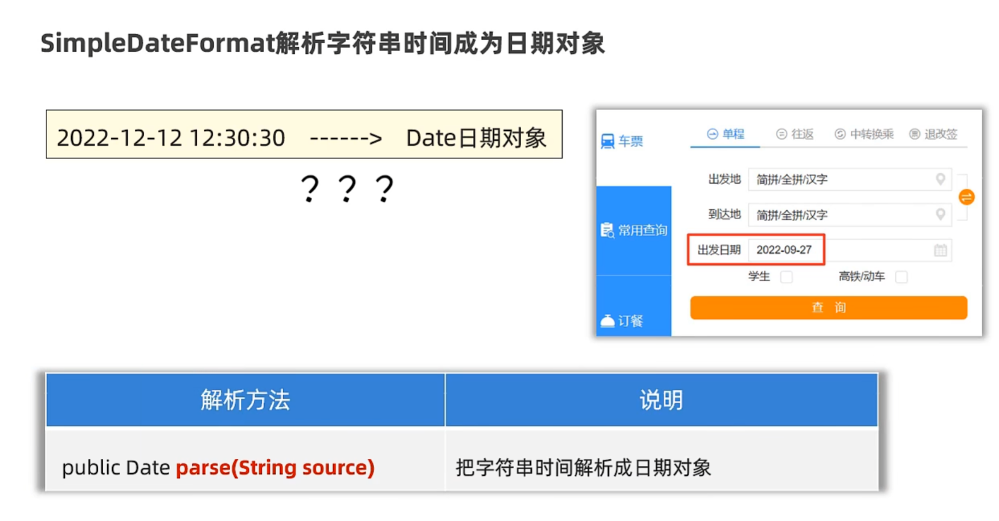

## Calendar

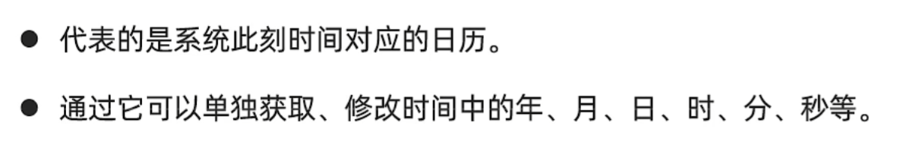

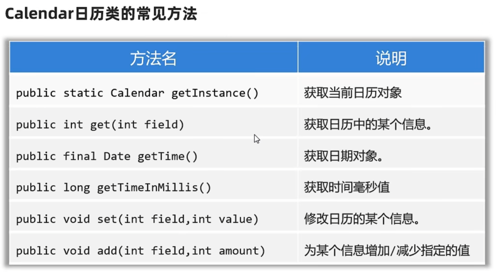

## 为什么要学JDK 8新增的时间

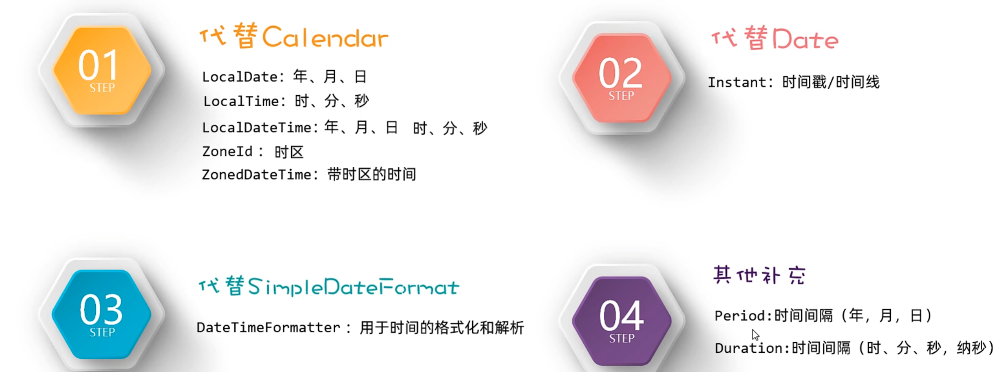

## LocalDate，LocalTime，LocalDateTime

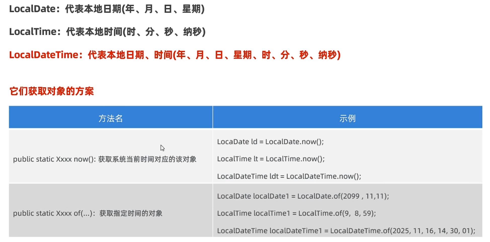

### LocalDate

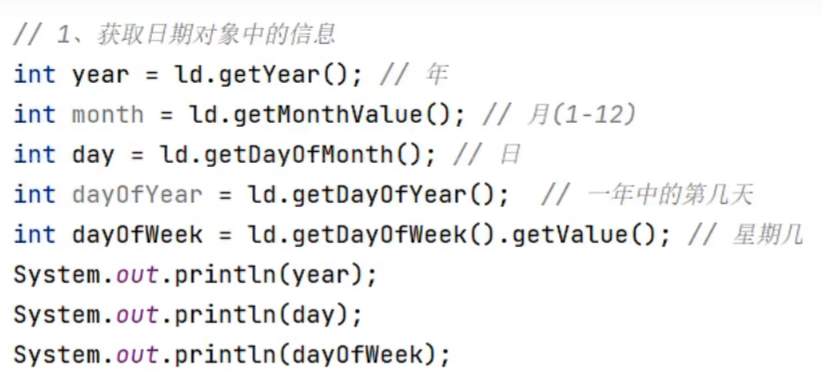

---

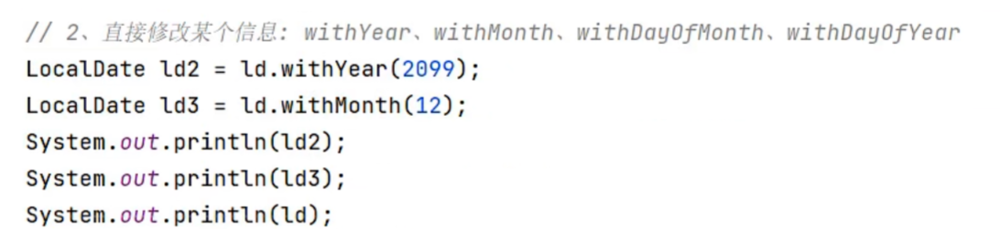

---

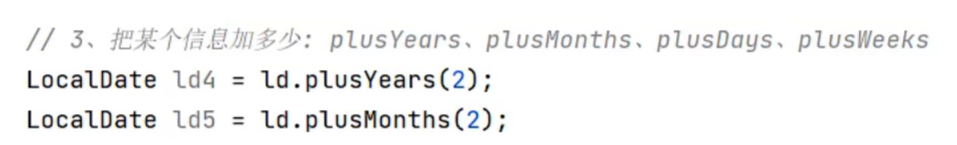

---

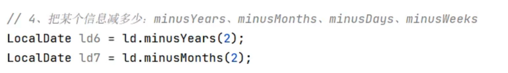

---

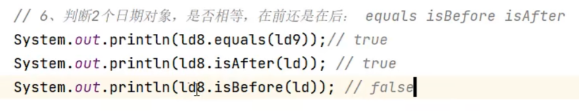

---

>LocalTime，LocalDateTime和LocalDate类似

### 总API

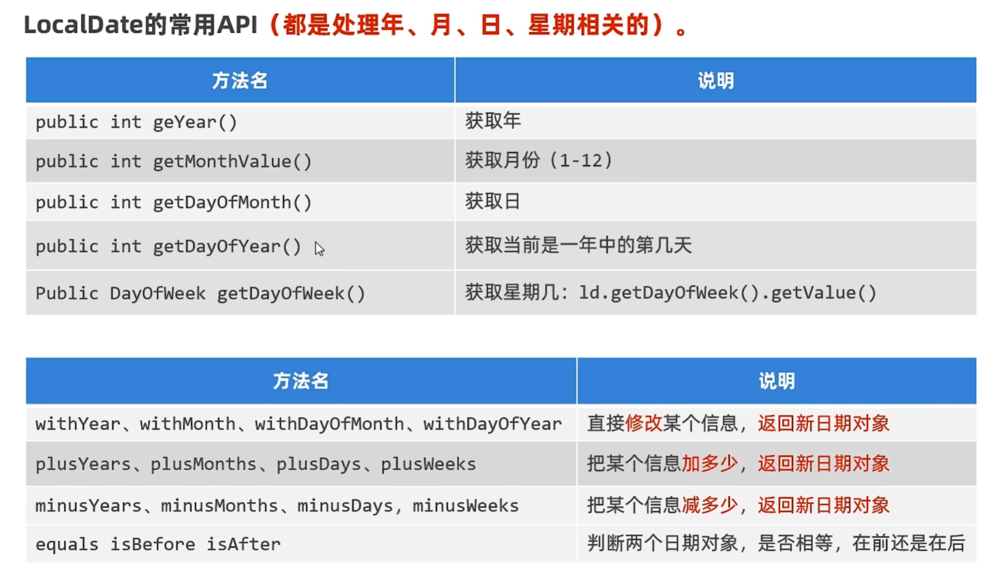

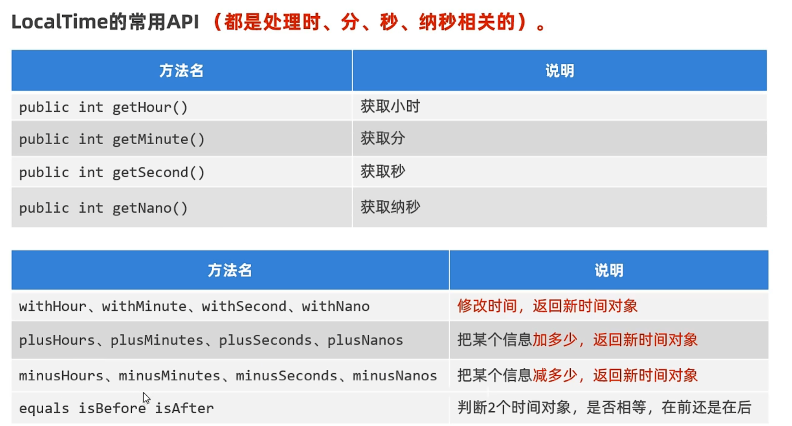

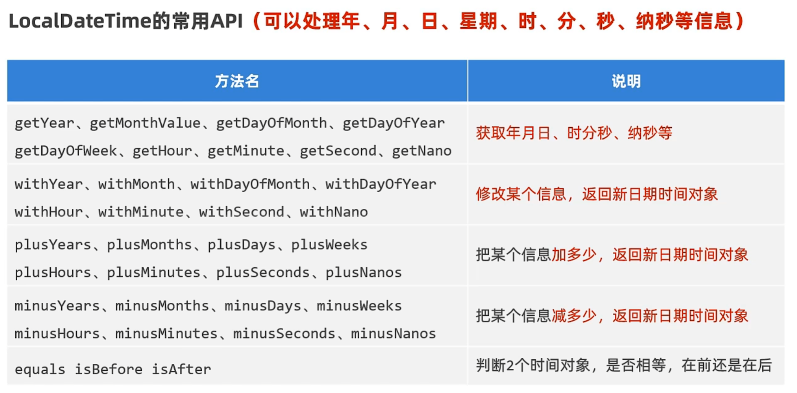

## zoneId

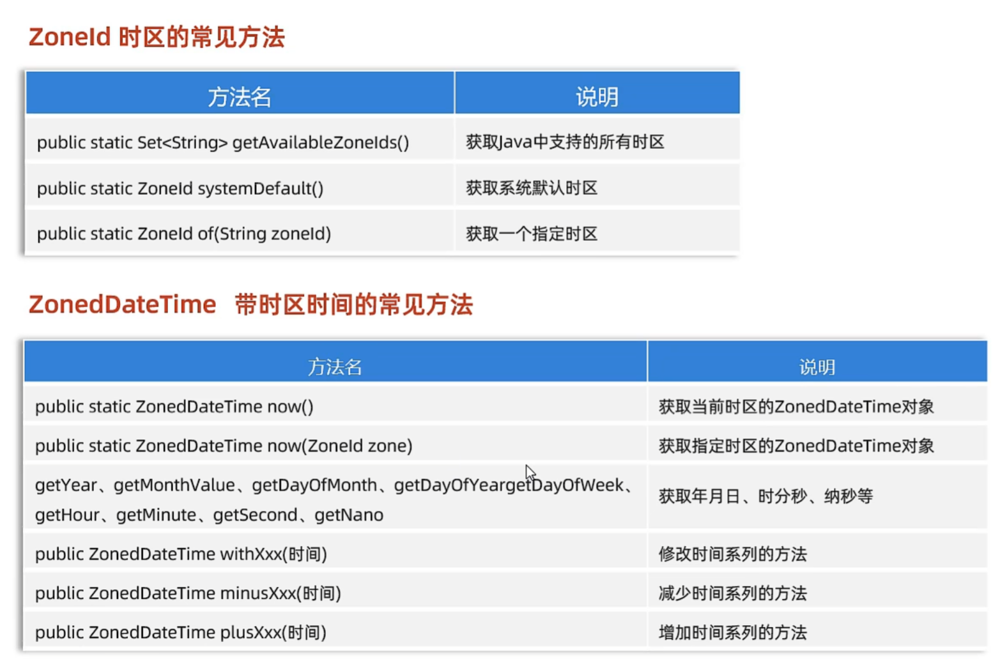

## Instant

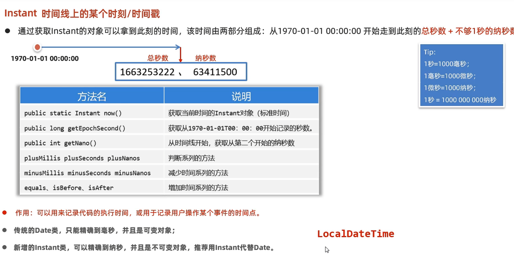

## DateTimeFormatter

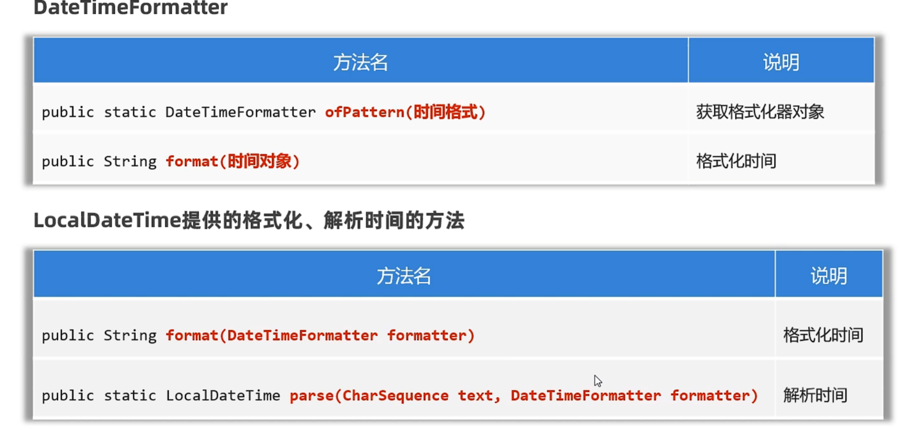

## Period

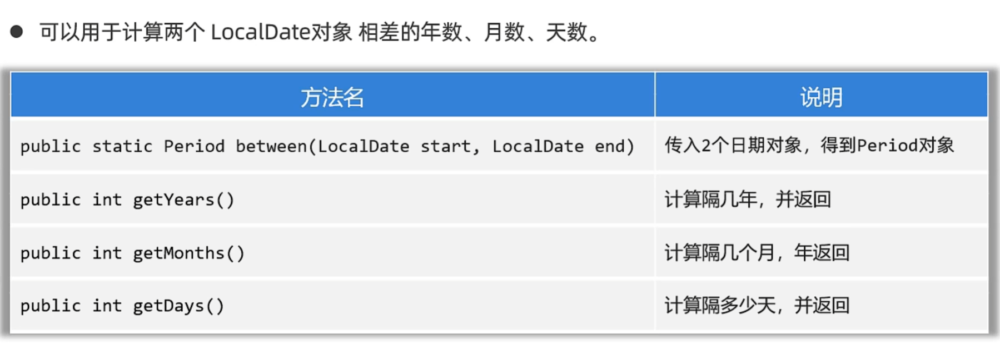

## Duration

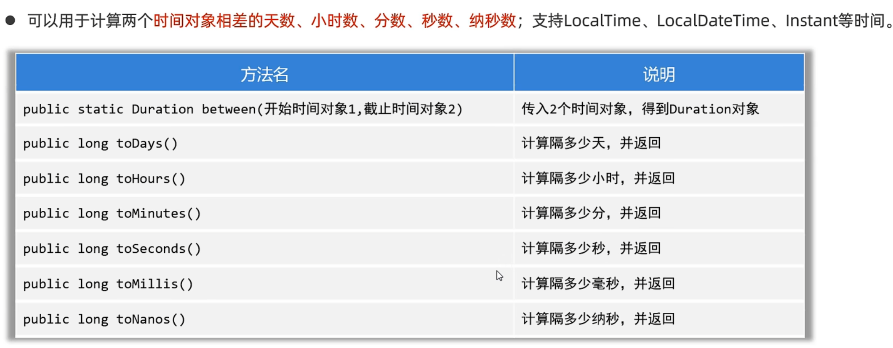

## Period和Duration的区别

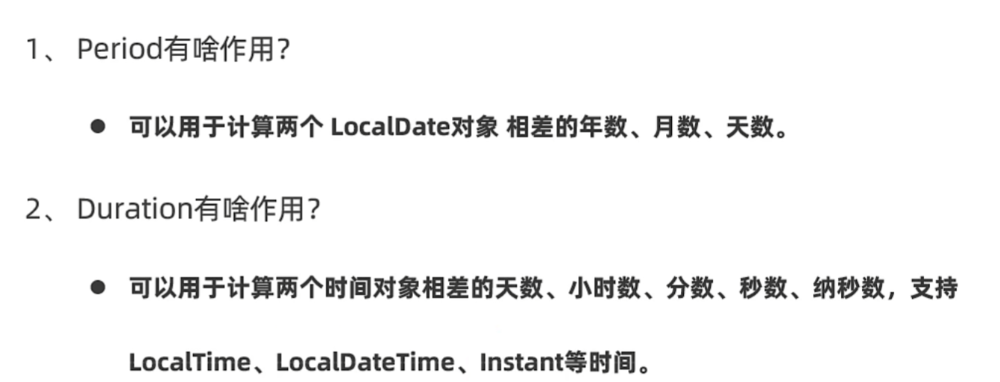

