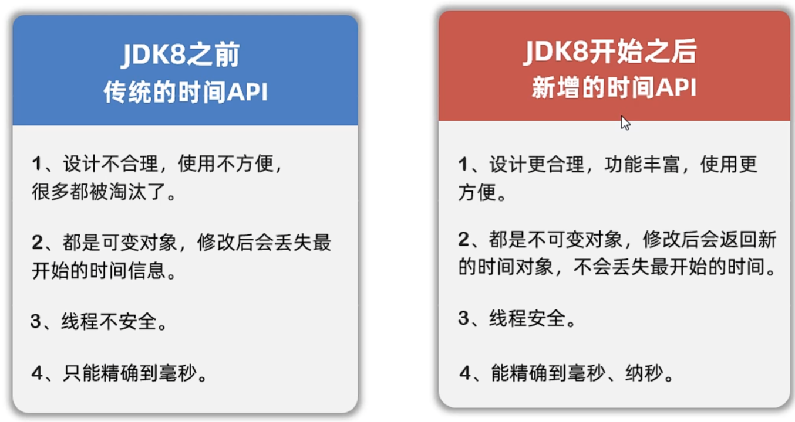

# 常用API2

## Date

## SimpleDateFormat

### 解析字符串时间成为日期对象

## Calendar

## 为什么要学JDK 8新增的时间

## LocalDate，LocalTime，LocalDateTime

### LocalDate

---

---

---

---

---

>LocalTime，LocalDateTime和LocalDate类似

### 总API

## zoneId

## Instant

## DateTimeFormatter

## Period

## Duration

## Period和Duration的区别

