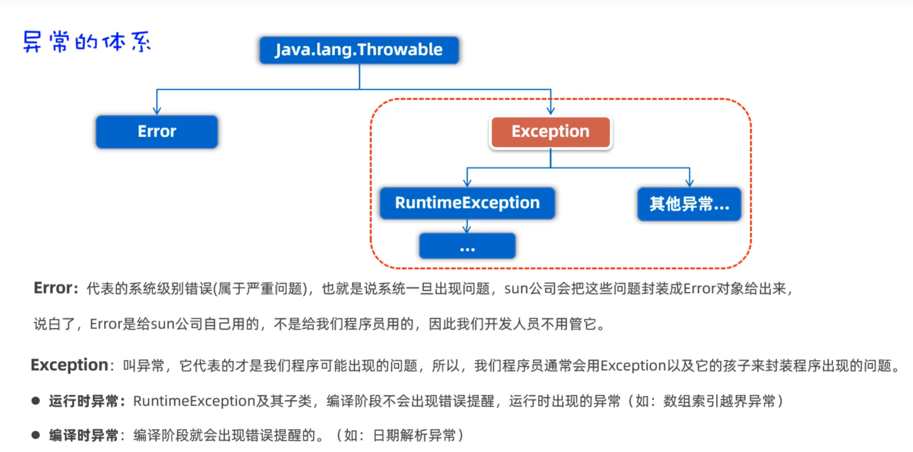
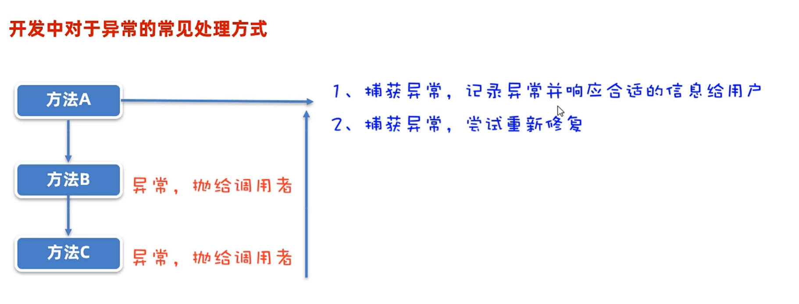
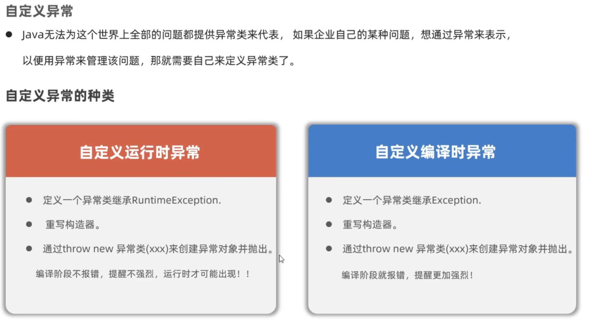
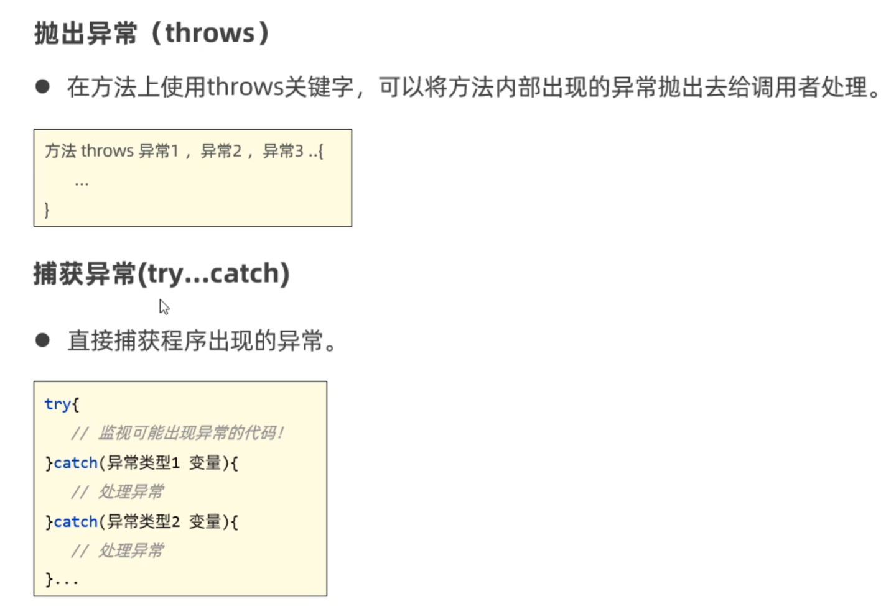

# 异常



如下列代码就是运行时异常：

```java
int[] arr = {11,22,33};
System.out.println(arr[5]);
```

## 两种处理方法




## 自定义异常



## 抛出异常和捕获异常

* 异常可以抛出给上层，让上层来处理该异常

>main方法的上层为JVM虚拟机

* 异常可以通过try...catch...方法捕获，捕获后当出现问题时可以给用户一个良好的回应

