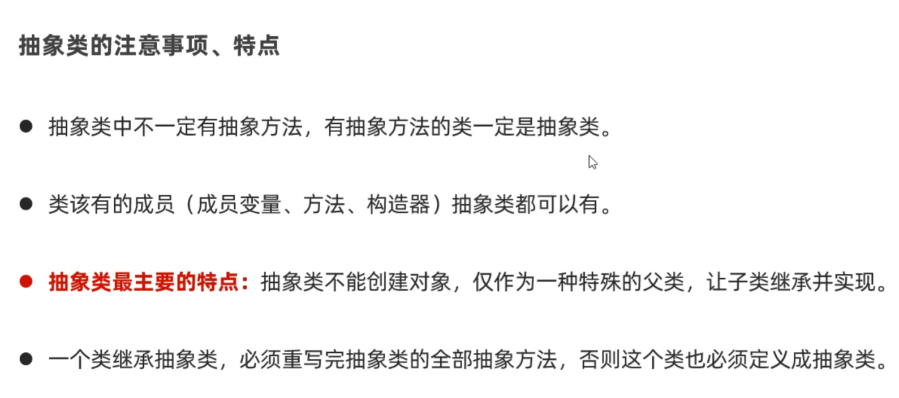
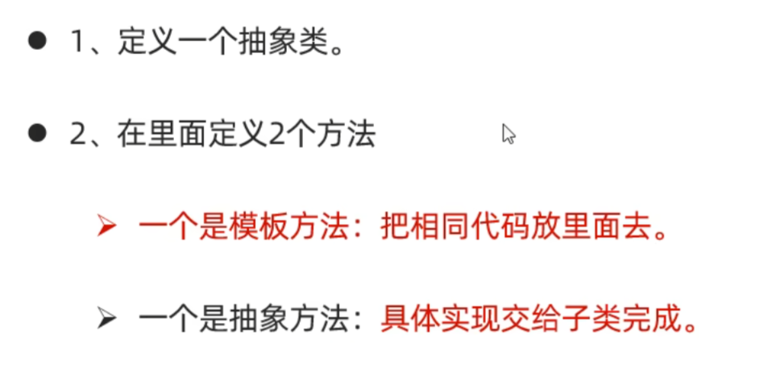
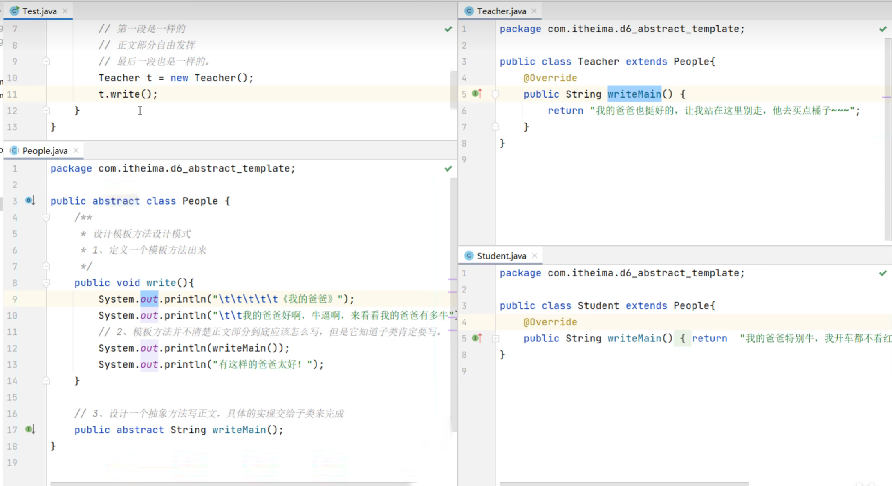

# 抽象类

使用abstract修饰

修饰类时，这个类就是抽象方法；修饰方法时，这个方法就是抽象方法

>抽象方法只有方法签名，不能写方法体

## 抽象类的注意事项和特点

## 抽象类的好处

父类知道每个子类都要做某个行为，但每个子类要做的情况不一样，父类就定义成抽象方法，交给子类去重写实现，**我们设计这样的抽象类，就是为了更好的支持多态**。

>使用抽象类将要求子类强制重写抽象方法，因此更好的支持多态

## 抽象类的常见应用场景：模板方法设计模式

解决方法中存在重复代码的问题

如下所示：

>建议使用final关键字修饰模板方法，（如上面的write就是模板方法），因为模板方法不是用来本重写，而是用来被子类直接使用