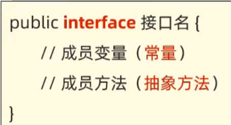
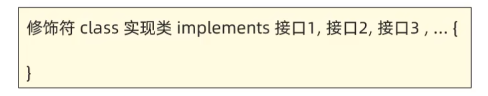
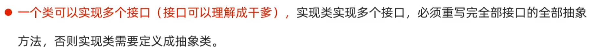
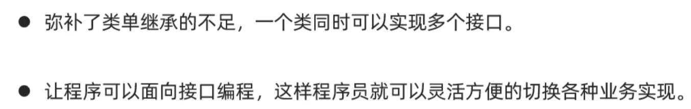
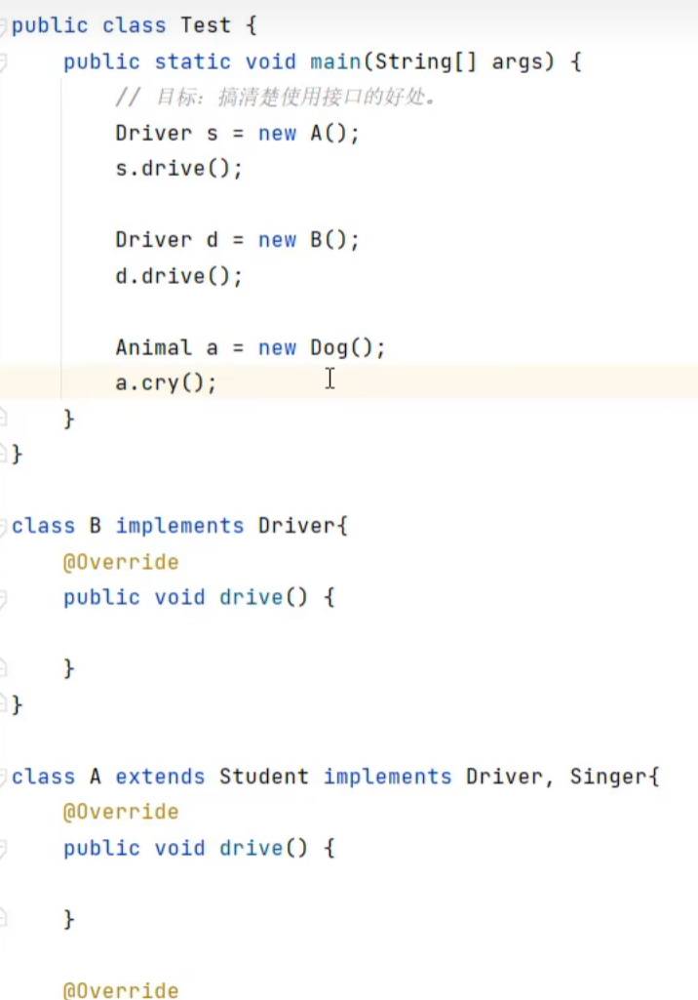
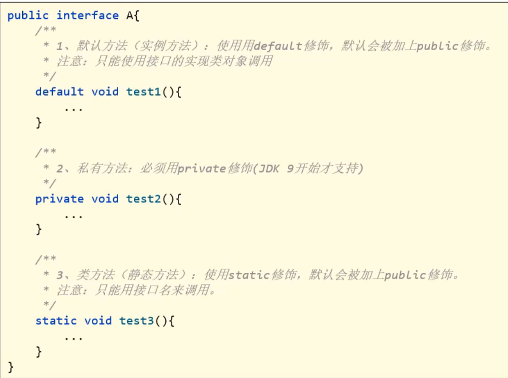
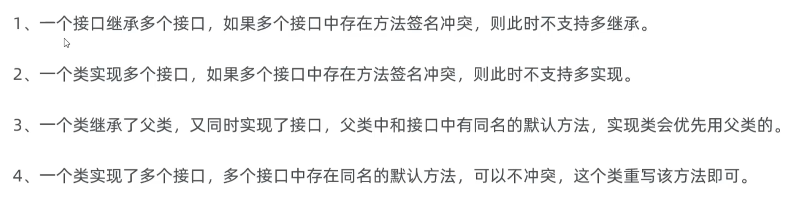

# 接口



实现接口的类被称为**实现类**





## 接口的好处



### 面向接口编程

如下列代码：



面向接口编程意味着前面的对象为Driver或Singer

此时由于**A类或B类**实现了接口，因此在**A类或B类**中重写的dirve()方法是不同的，因此若需要修改时，直接修改new后面的A或B即可修改成想要的dirve()方法

>在多态中，也可修改new后面的Dog()为Cat()，此时cry()方法将不同

## 接口的其它细节

### JDK8开始，接口新增的三种方法



>私有方法可以在test1()或test3()中使用

#### 为什么要新增这些方法

* 增强了接口的能力，更便于项目的扩展和维护

### 接口的多继承

```java
public interface C extends B,A{

}
```



