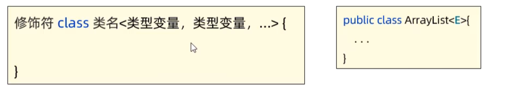
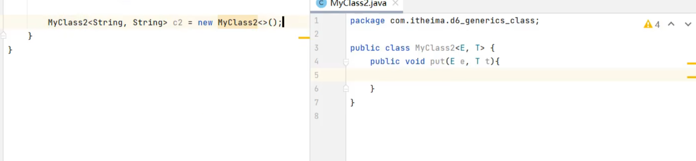
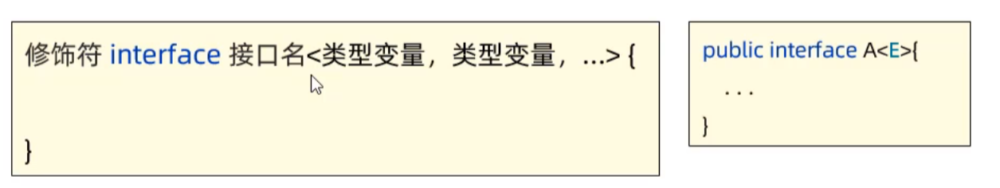
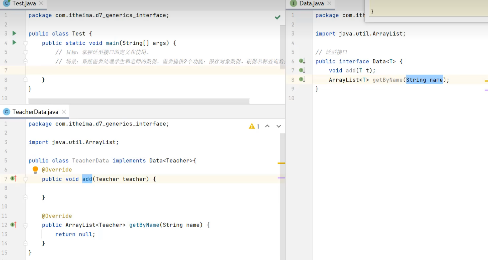
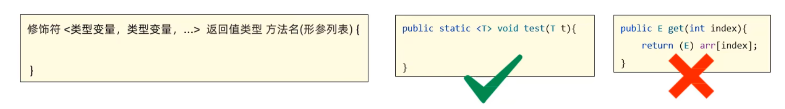
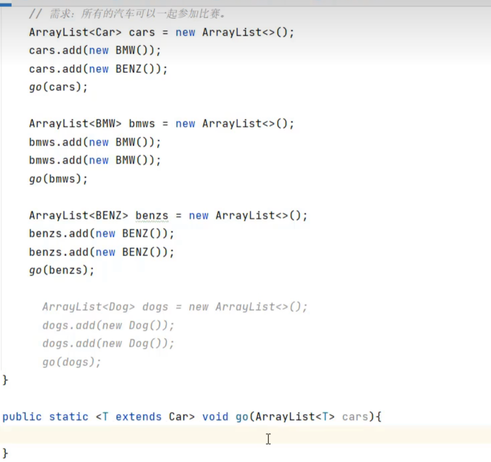
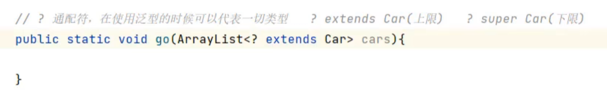

# 泛型

定义类、接口、方法时，同时声明了一个或者多个类型变量（如：<E>），成为泛型类、泛型接口、泛型方法，它们统称为泛型

作用：泛型提供了在编译阶段约束所能操作的数据类型，并自动进行检查的能力，这样可以避免强制类型转换，及其可能出现的异常

>泛型的本质：把具体的数据类型作为参数传给类型变量

# 泛型类

对MyClass2类，由于在声明对象时限定了两个类型都为String，因此之后使用MyClass2类传入的参数必须为两个String型的

## 泛型接口

对于Data接口，由于限在TeacherData实现类中限定了传入接口的数据必须为Teacher型的，因此在方法add以及getByName前面都必须为Teacher型

## 泛型方法

当go方法中的参数列表为ArrayList<Car> cars时，此时go(bmws)和go(benzs)将会报错，因为他们两个虽然是继承了Car类，但是**不能这样使用**

而若在go方法的修饰符后面为<T>时，此时go(dogs)也能使用，明显是不符合常理的，因此可以使用<T extends Car>来限定条件

* 修饰符与返回值类型中间的 泛型标识符 <T>,是 泛型方法的标志，只有这种格式声明的方法才是泛型方法。
* 泛型方法声明时的 泛型标识符 <T> 表示在方法可以使用声明的泛型类型。

## 通配符

## 泛型的擦除问题和注意事项

>如int,double都不能使用在<>内

