# Java继承

## 继承的特点

子类能继承父类的非私有成员（成员变量、成员方法）

## 继承后对象的创建

子类的对象是由子类、父类共同完成的

若有
```java
B b = new B();
```
假设B继承了父类A，则此时b为A和B共同创建的对象，b可以使用A和B内所有public的东西（变量和方法）

## 继承的执行原理

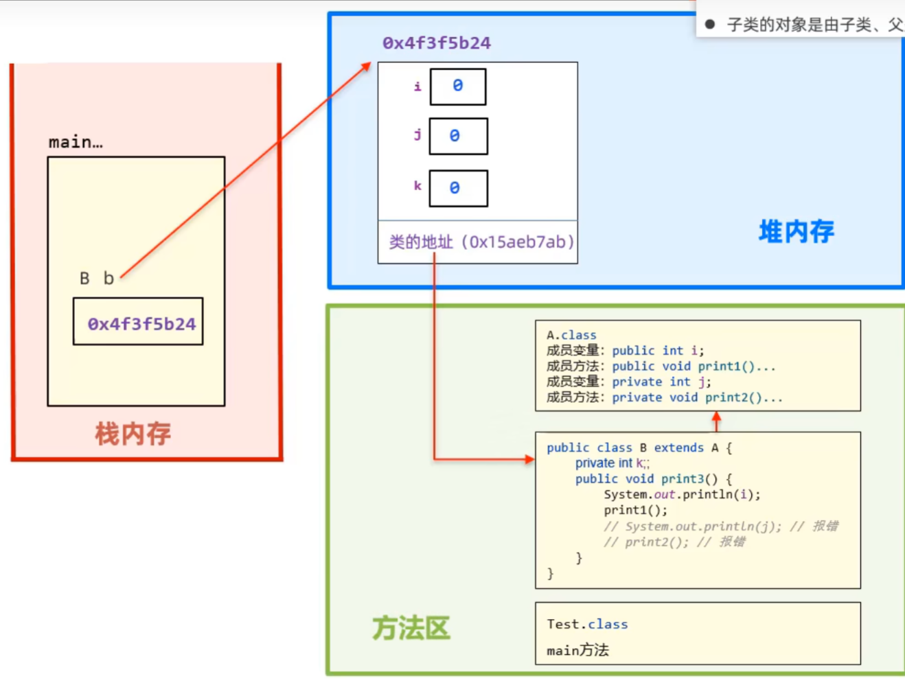

由A和B共同创建的对象b，在堆内存中开辟空间时，里面将存入A和B中可以使用东西（变量和方法）的总和

>子类对象实际上是由子父类这两张设计图共同创建出来的


## 继承的好处

减少重复代码的编写

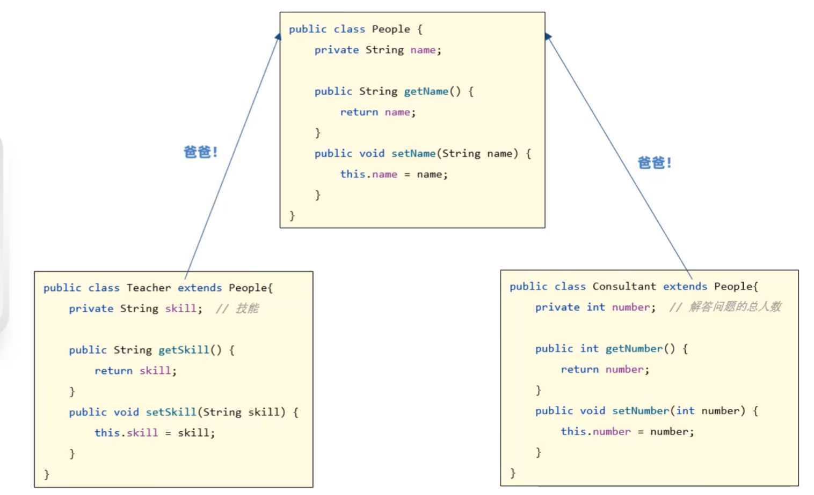

该代码中，Teacher和Consultant共同继承了一个People类，提高了代码复用性

## 注意事项

### 权限修饰符

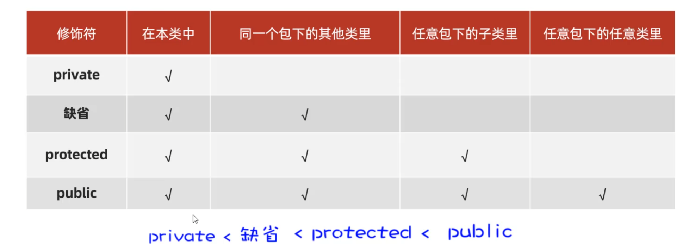

protected注意一定是在**子类**中访问，即使在其它类中创建该子类对象，也不能访问

### 单继承

Java是单继承，Java中的类不支持多继承，但是支持多层继承

>即一个子类只能有一个父类，一个父类可以有多个子类

### Object类

Object类是java所有类的祖宗类，所有java类都可以使用Object类中的方法

## 方法重写


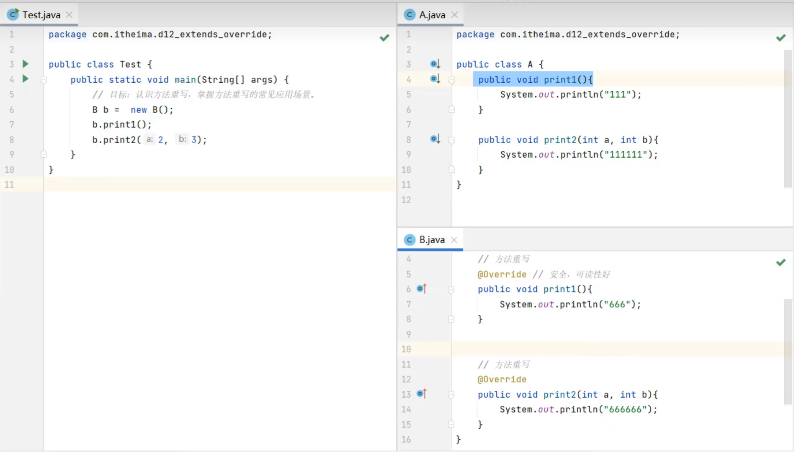

>就近原则：对象b会优先使用子类B重写后的方法

### 注意事项

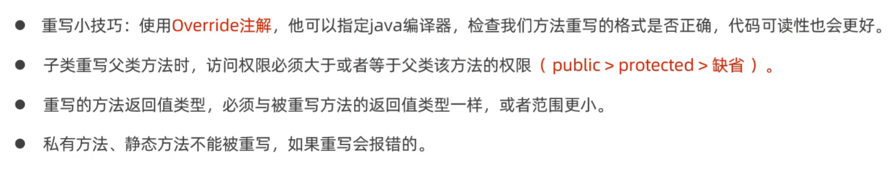

### 方法重写的应用场景

子类重写Object类的toString()方法，以便返回对象的内容

toString方法原本的作用是生成对象，如下列代码的输出为：


```java
Student s = new Student("John", "20");
System.out.println(s.toString());
System.out.println(s);
```

可见原来的toString()方法并没有特别大的用处，此时就可以重写toString()方法，如下列代码：

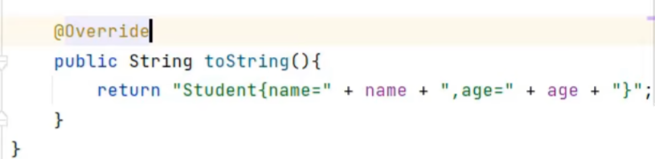

对Studen类中的toString()方法进行了重写，此时的输出变成了：

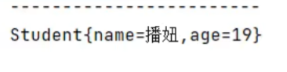

此时toString()方法的作用为输出对象的内容

>可使用鼠标右键，单击“生成”，选择toString()快速重写方法

>在一些对象中如ArrayList集合中定义一个对象list，此时直接输出list得到的就是对象的内容，可见在ArrayList集合中toString()方法已被重写

## 就近原则和super

在子类中访问其他成员（成员方法、成员变量），是依照就近原则的
* 先子类局部范围找
* 然后子类成员范围找
* 然后父类成员范围找，如果父类范围还没有找到则报错

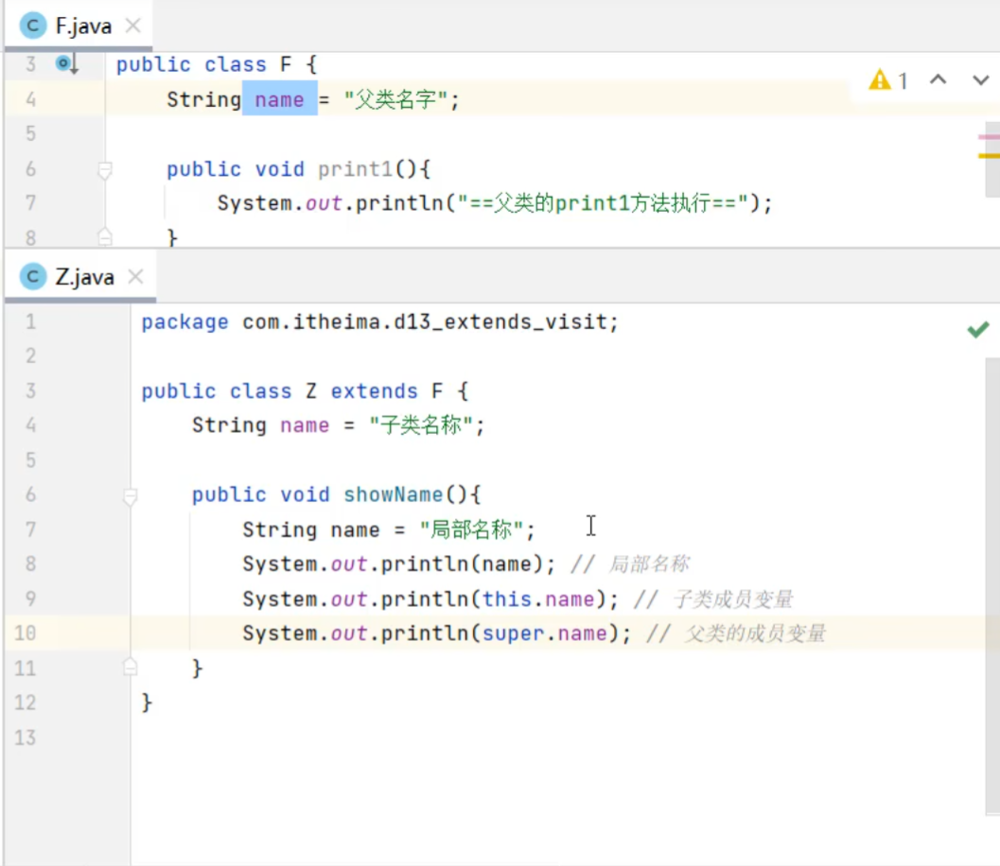

在Z类中若直接输出name变量，输出的是最近的“局部名称”

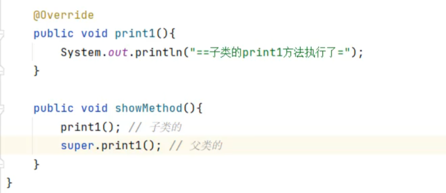

在Z类中若直接输出print1()方法，优先使用的是最近的Z类中的print1()方法

### super

对于父类F类和子类Z类，super()就相当于F()，this()就相当于Z()

>即两个东西相当于两个构造器，且**this()和super()都只能放在第一行**

## 子类构造器

子类的全部构造器，都会先调用父类的构造器，再执行自己的


如下列代码：

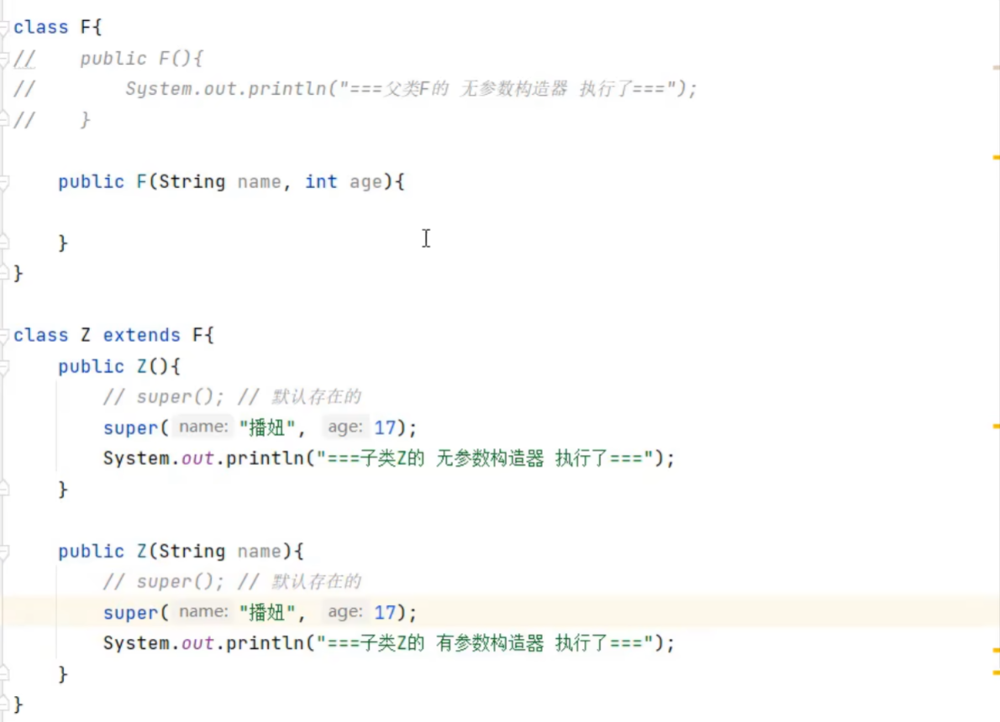

由于在父类F中定义了有参构造器，因此F中将不会自动生成无参构造器，因此对子类Z的构造器来说，super()将无法使用，因此**必须手动添加含有参数的super()作为父类的有参构造器**

### 子类构造器调用父类构造器的常见应用场景

在继承情况下，由于处理对象数据的构造器，拆分到了多个类里，因此需要调用多个构造器，才能将数据处理完整

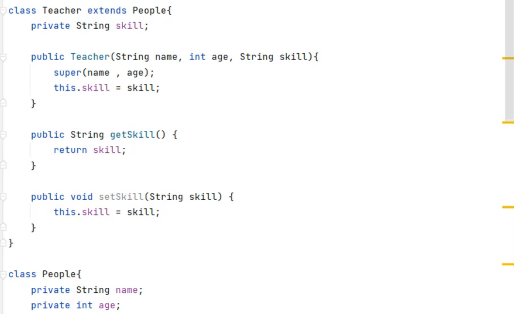

改代码中，由于People类中的name和age都是private型，因此只能使用People类中自带的有参构造器为属性赋值，而子类的对象因此只能使用super关键字在子类Teacher类中先为父类中的属性赋值，再为自己的属性赋值

### this(...)调用兄弟构造器

任意类的构造器中，是可以通过this(...)去调用该类的其他构造器的