# 集合框架1 Collection_List

## 链表和数组

### 链表

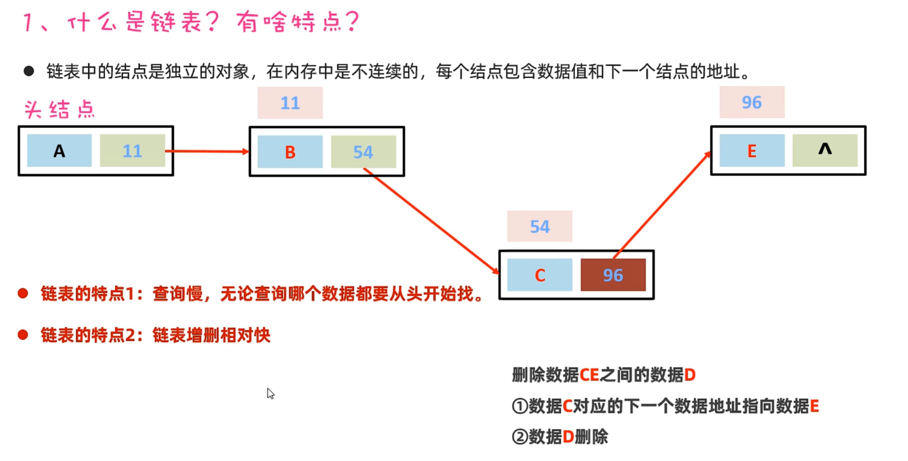

### 数组

查询快，相对链表增删较慢

## 集合体系结构

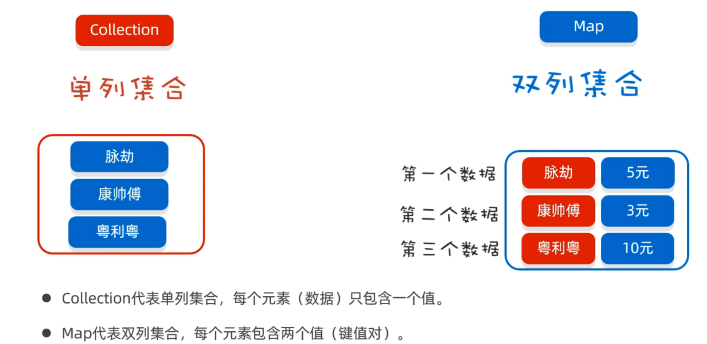

## 集合体系

* Collection是单列集合的祖宗，它规定的方法（功能）是全部单列集合都会继承的

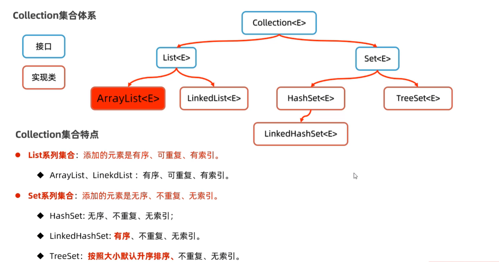

常见方法：

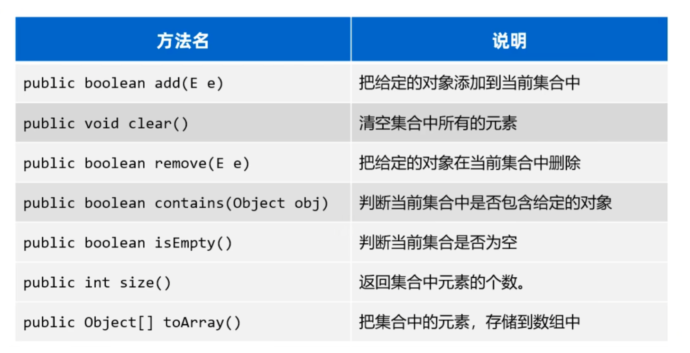

## Collection的遍历方式

Collection不能使用普通for循环

### 迭代器

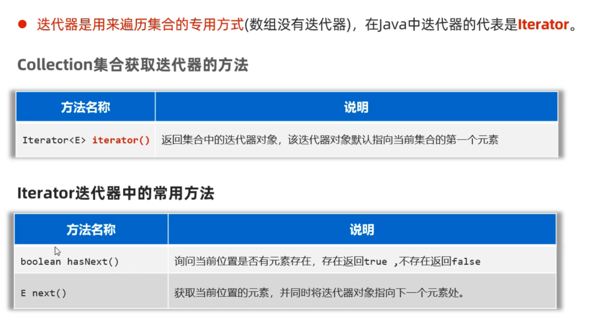

可用循环为Collection添加数据：

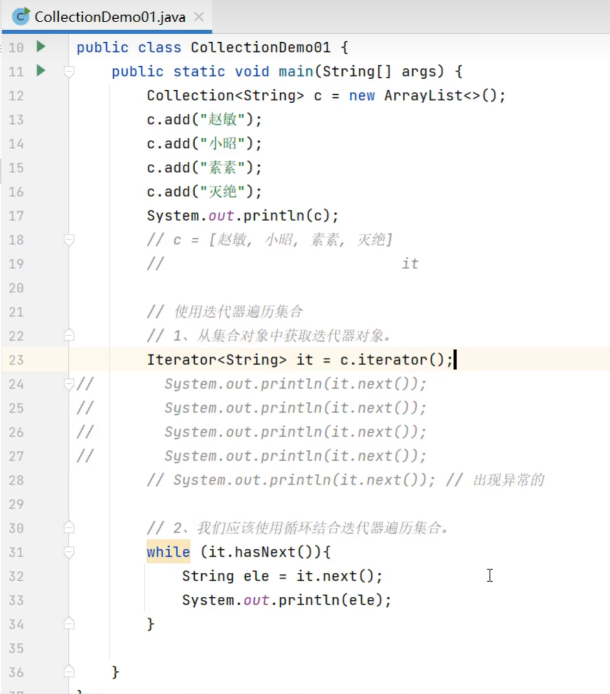

每一次it.next()都会使元素后移一位，但假如使用如下方式：

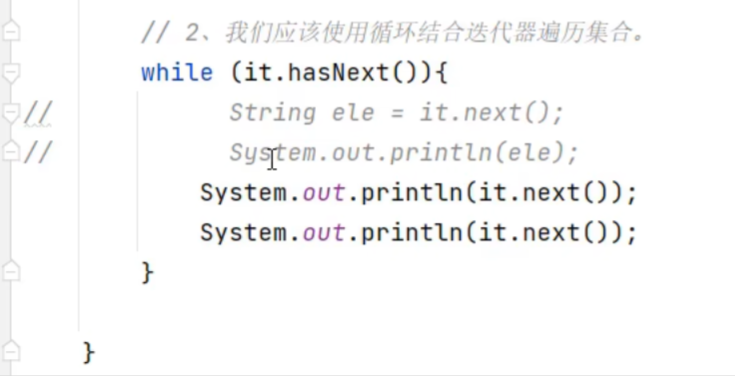

此时若c里面只有三个元素，将会报错，因此在写代码时应当使用一次it.hasNext()才使用一次it.next()，不能使用两次it.next()

### 增强for循环

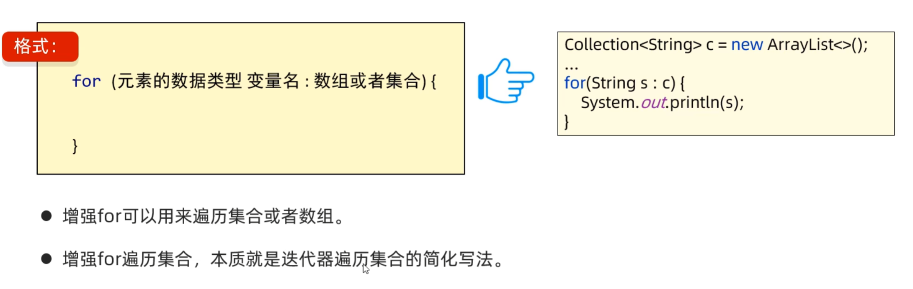

### Lambda表达式遍历集合

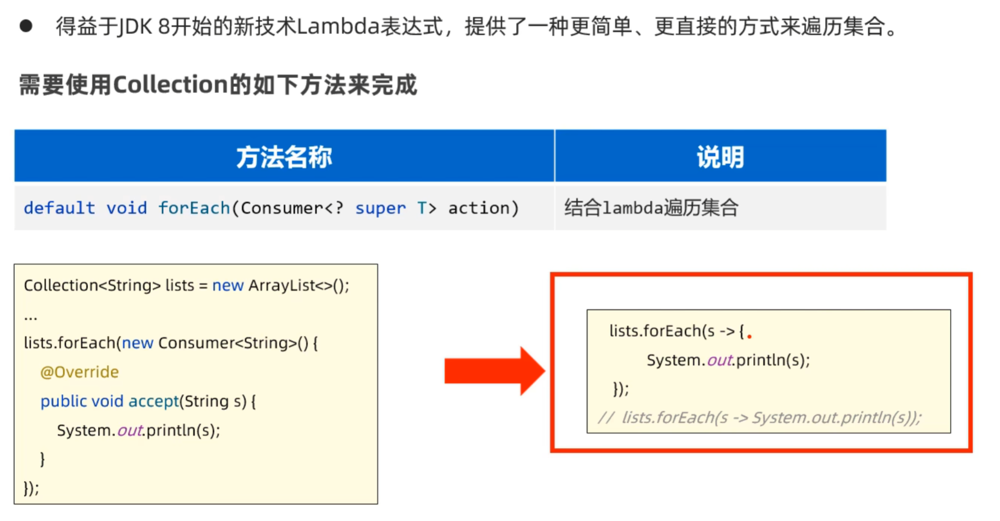

## List

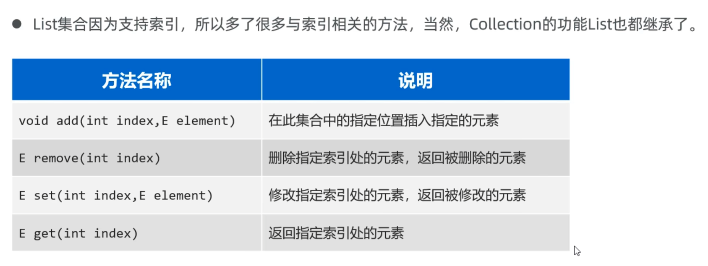

### List的遍历方式

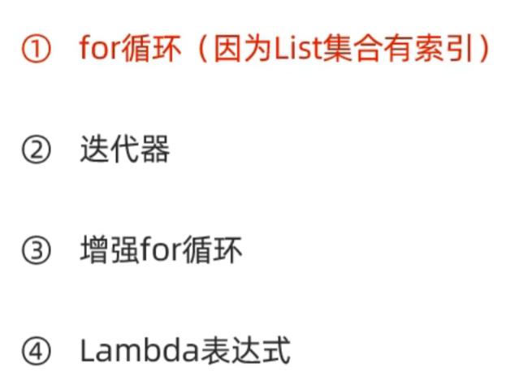

## ArrayList

### ArrayList集合的底层原理

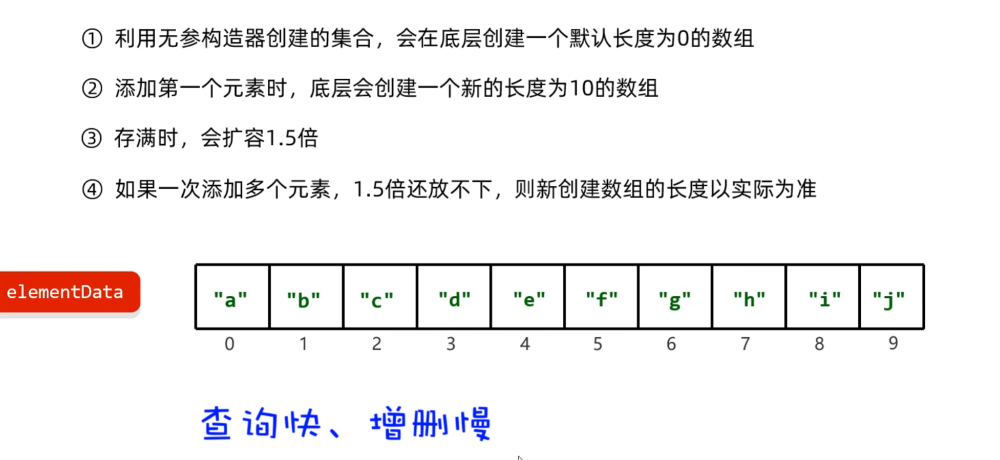

### Arraylist的应用场景

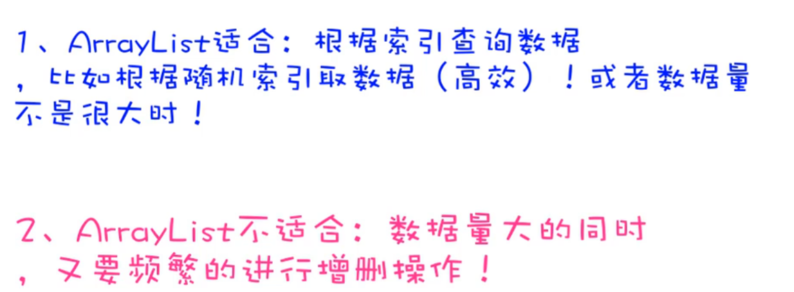

## LinkedList

### LinkedList的底层原理

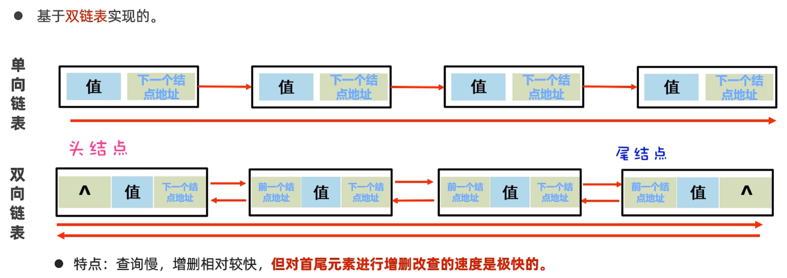

### LinkedList的方法

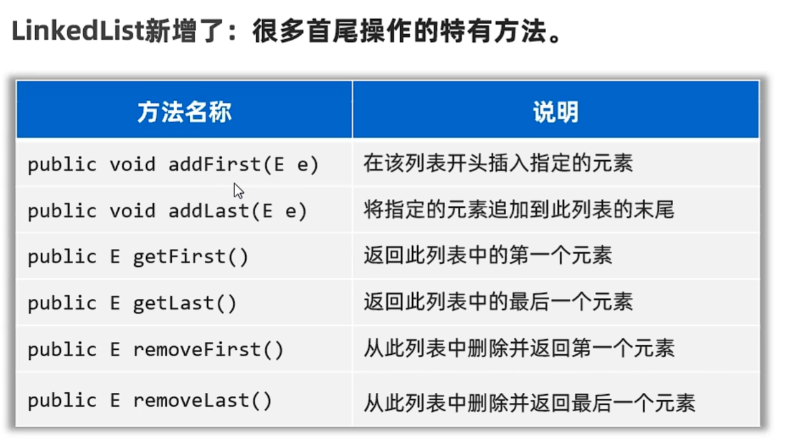

### LinkedList的应用场景

#### 设计队列

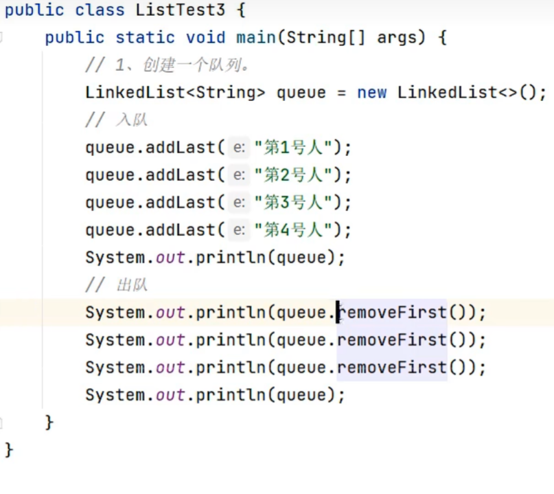

#### 设计栈

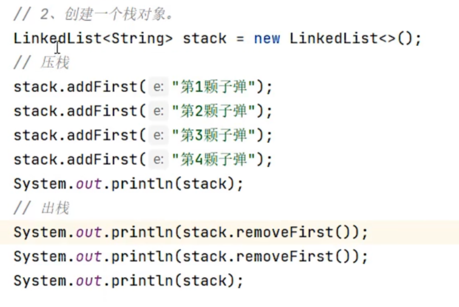

Java为LinkedList集合设计了push和pop方法，使得出栈和入栈更方便

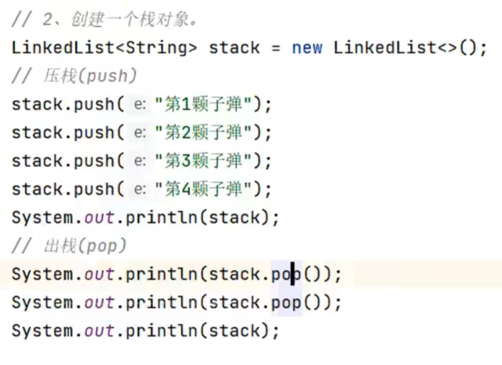

