# 集合框架2 Collection_Set

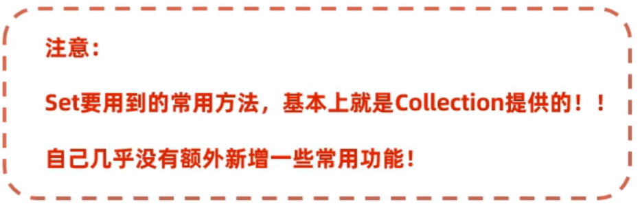

## 集合体系

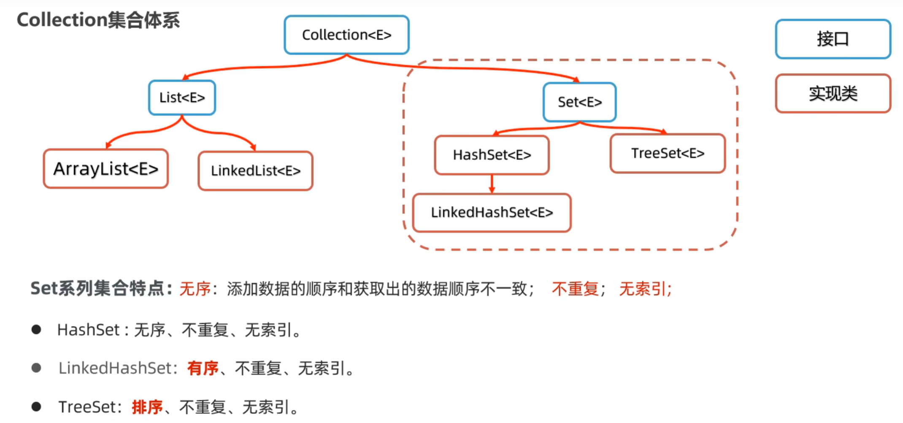

## HashSet

创建HashSet的集合对象：

```java
Set<E> set = new HashSet<>();//这是一行常用的代码
```

>HashSet的无序指的**不是**每一次运行程序时的顺序都不同，而是一次执行完以后，后面的顺序都跟第一次执行时相同

### 哈希值

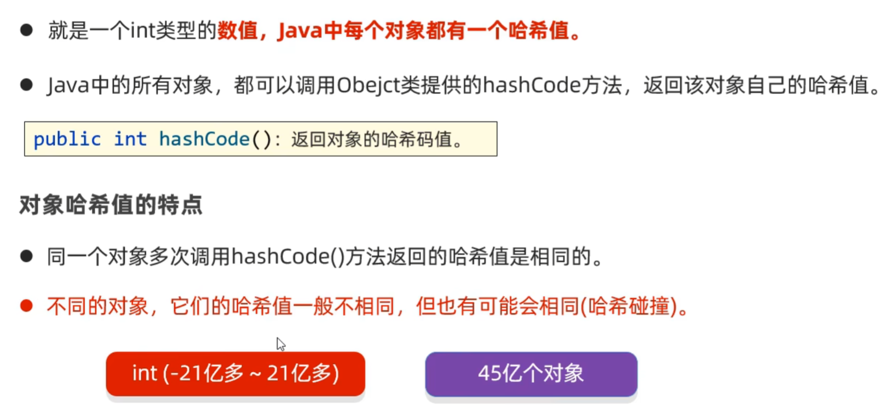

### 底层原理

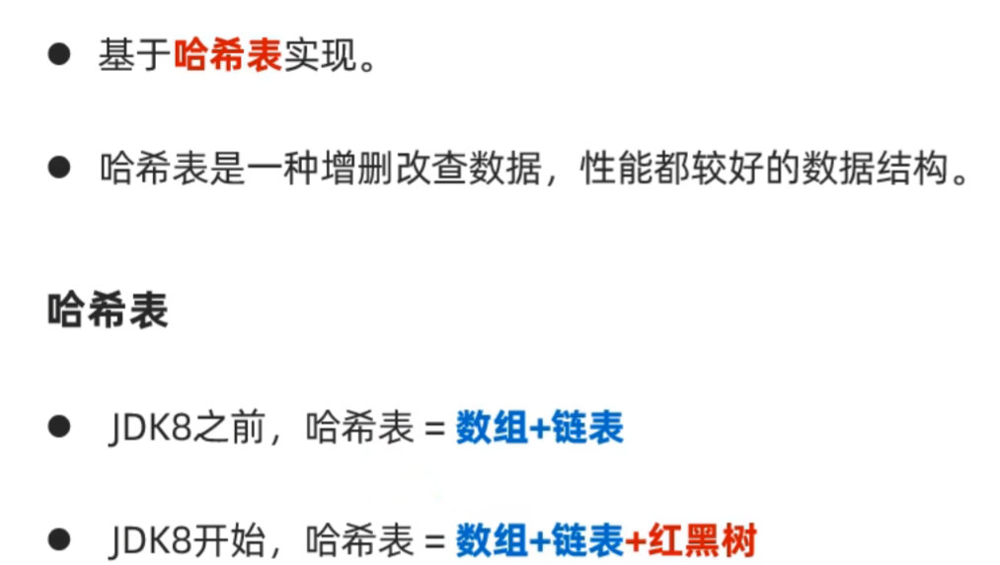

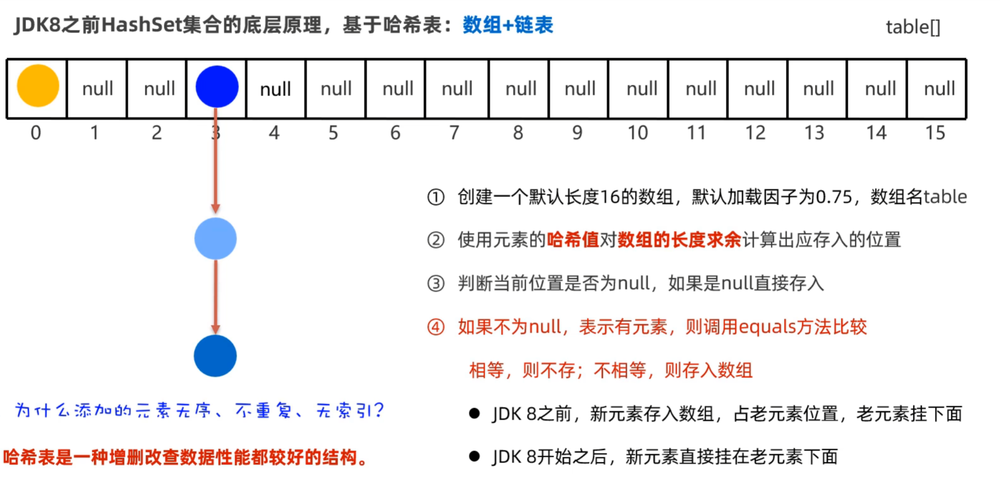

## 如果数组快占满了，会出什么问题？该怎么办？

* 链表会过长，导致查询性能降低
* 扩容

扩容指根据加载因子：

>16 * 0.75 = 12

可得到一旦数组中的元素超过12个，将会扩容至原数组的两倍大小

然而即使扩容，仍然有链表可能长度超过8，因此：

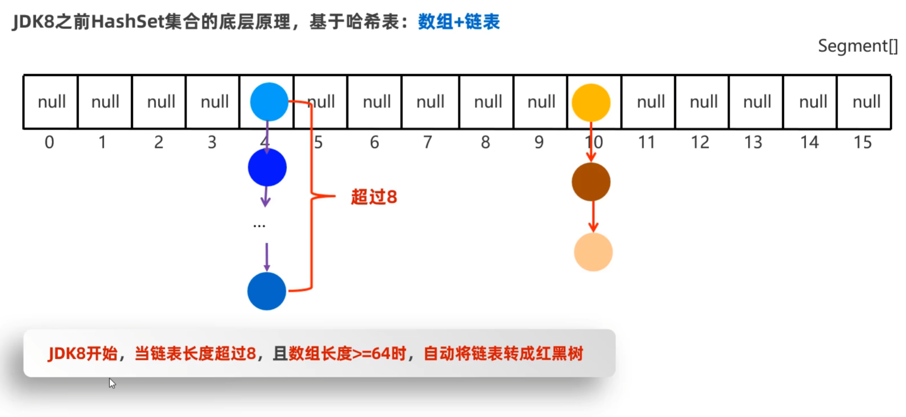

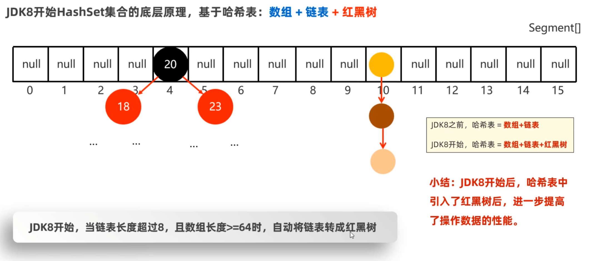

对上述红黑树，小的数将往左边走，大的数将往右边走

## 红黑树

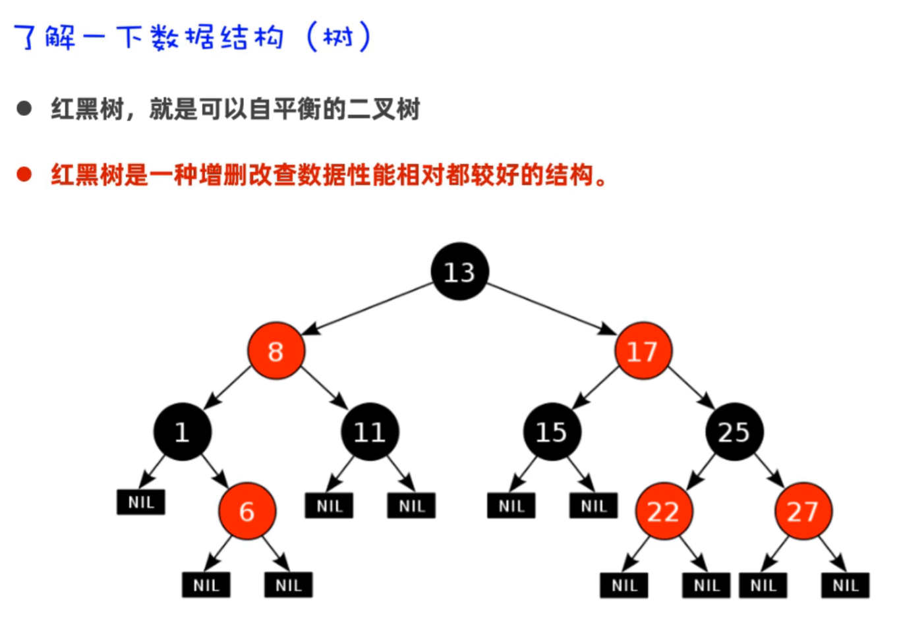

## 去重复机制

HashSet集合默认不能对内容一样的两个不同对象去重复

>即内容一样的两个对象存入HashSet集合时，不能去重复

### 重写hashCode()和equals()方法

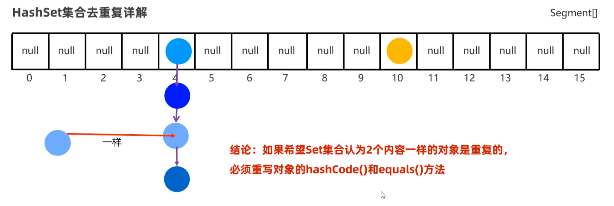

只有当哈希值一样时，两个对象才能在一个链表中通过比较内容是否相同来去重复


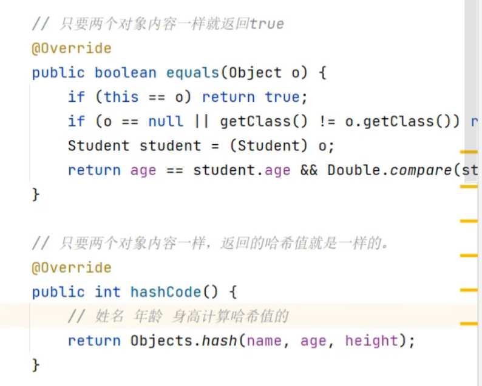


## LinkedHashSet

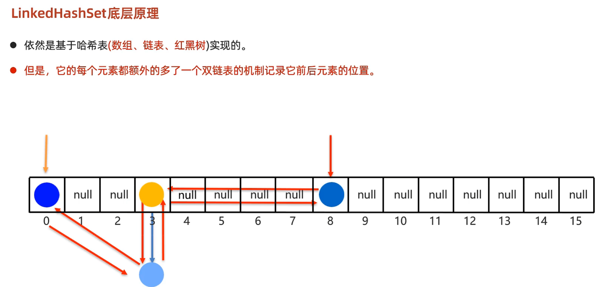

>通过占用内存，使得有序

## TreeSet

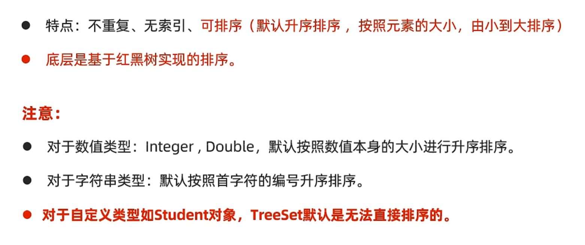

### 自定义排序规则


## 总结

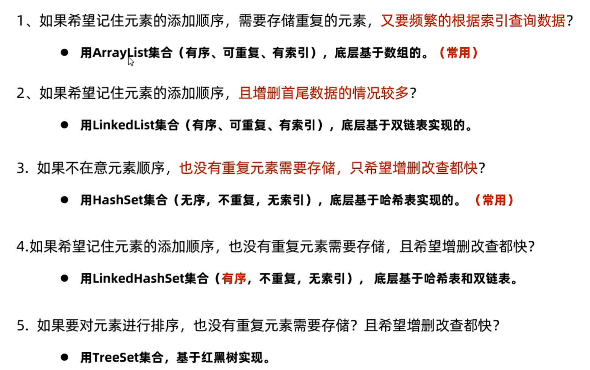

## 集合的并发修改异常

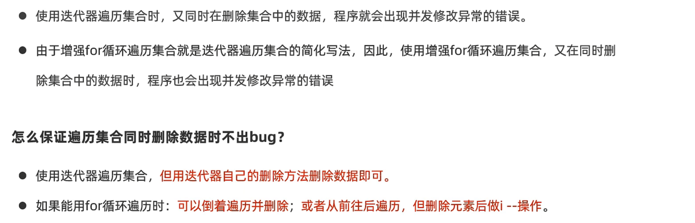

## 可变参数

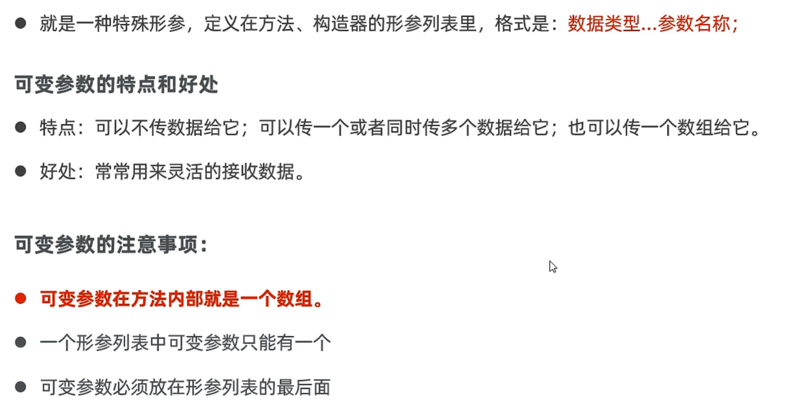

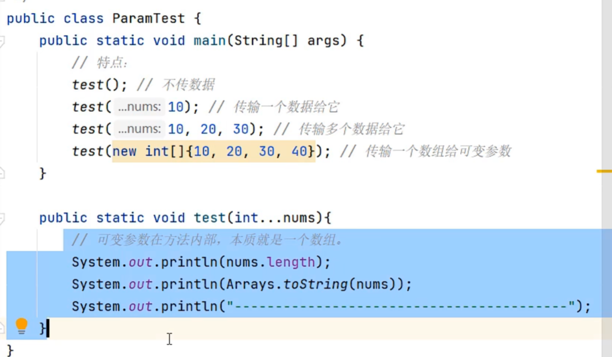

## Collections工具类

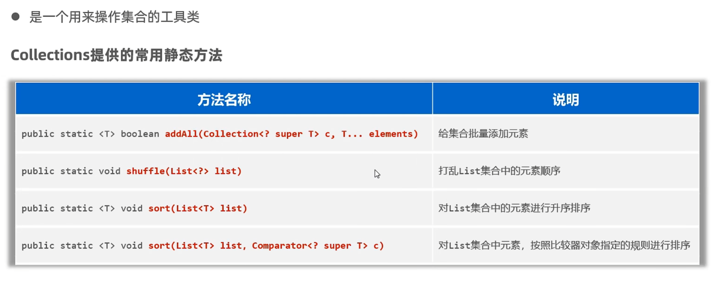

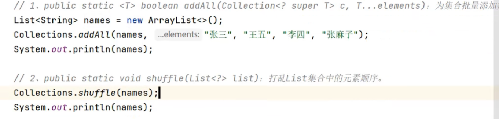

对于sort，制定比较规则：


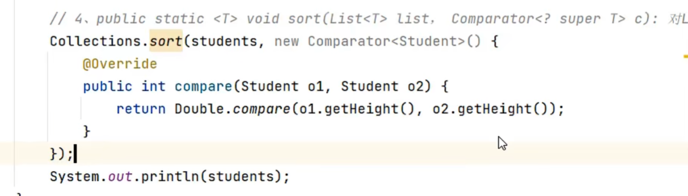

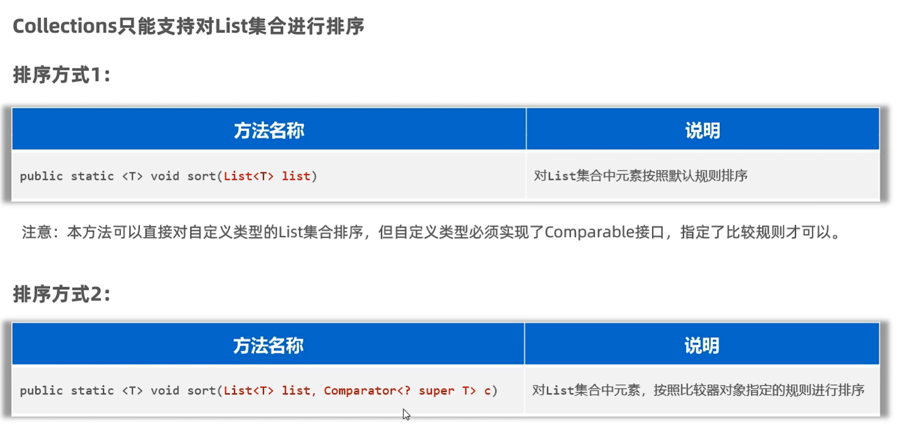

