# 集合框架 Map

## Map集合体系

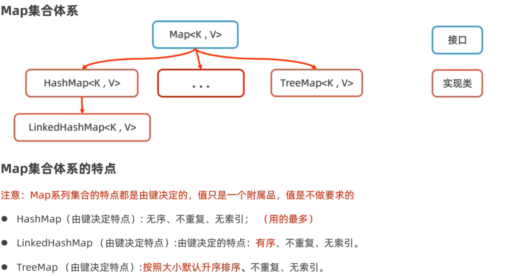

## Map集合的业务场景

需要存储一一对应的数据时，就可以考虑使用Map集合来做

## 常用方法

## Map集合遍历方式

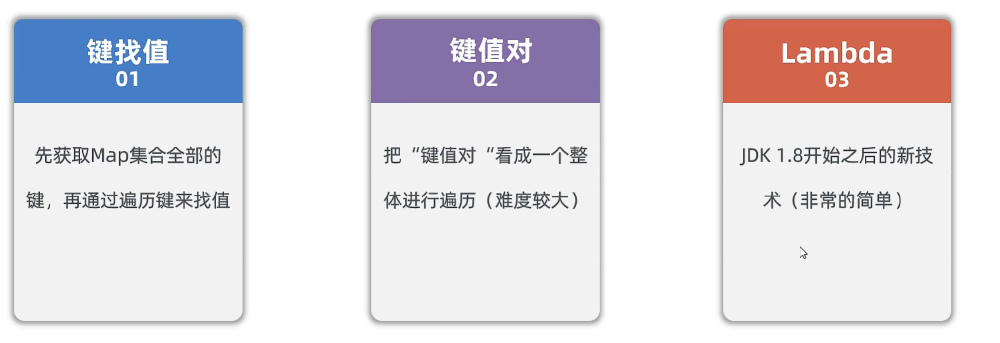

### 键找值

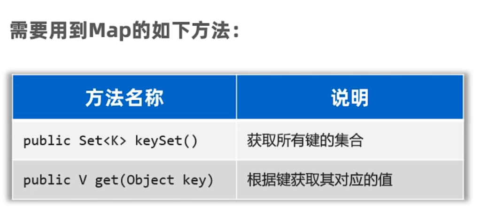

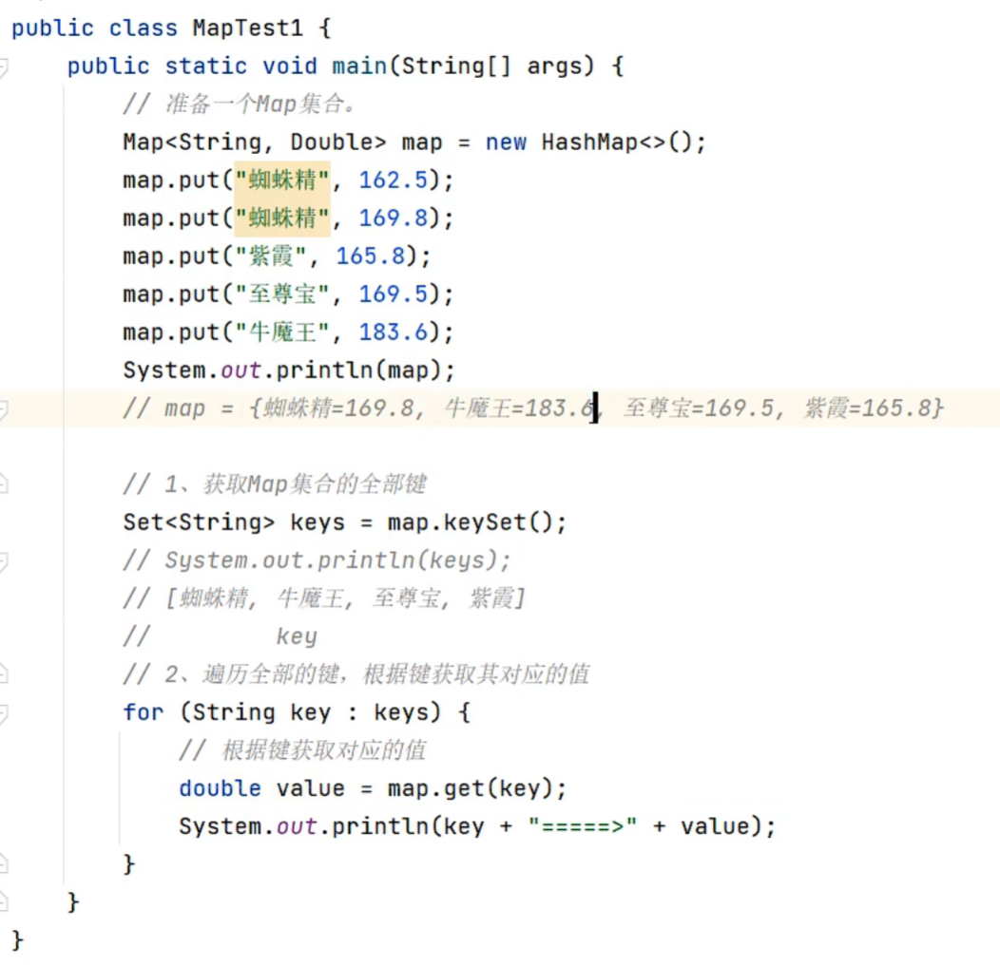

### 键值对

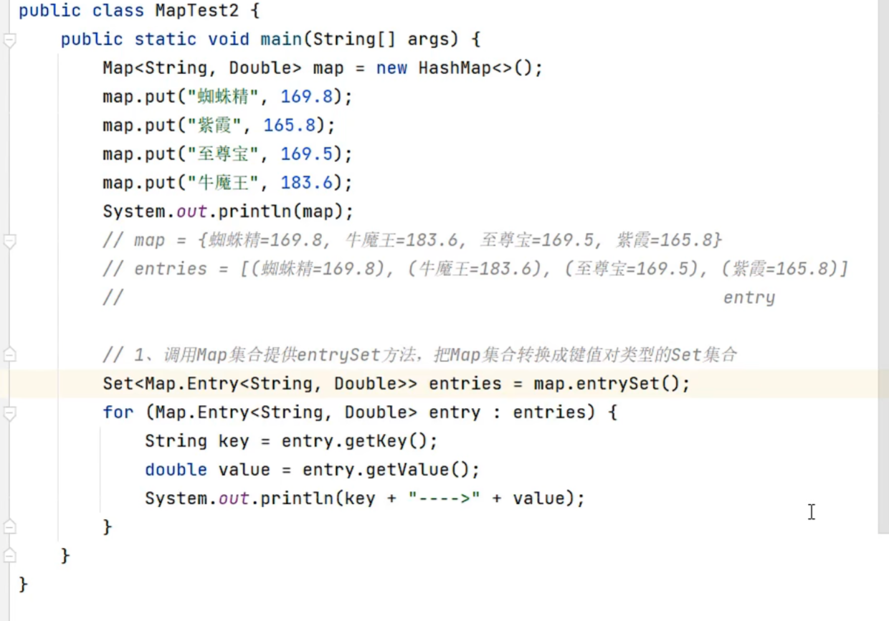

### Lambda

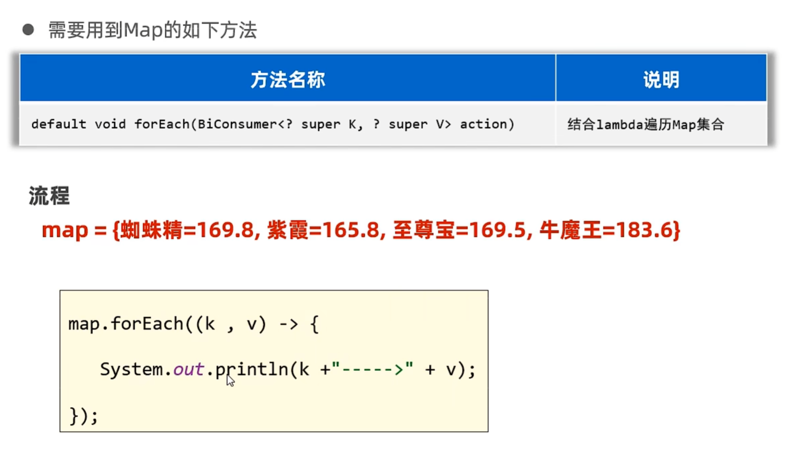

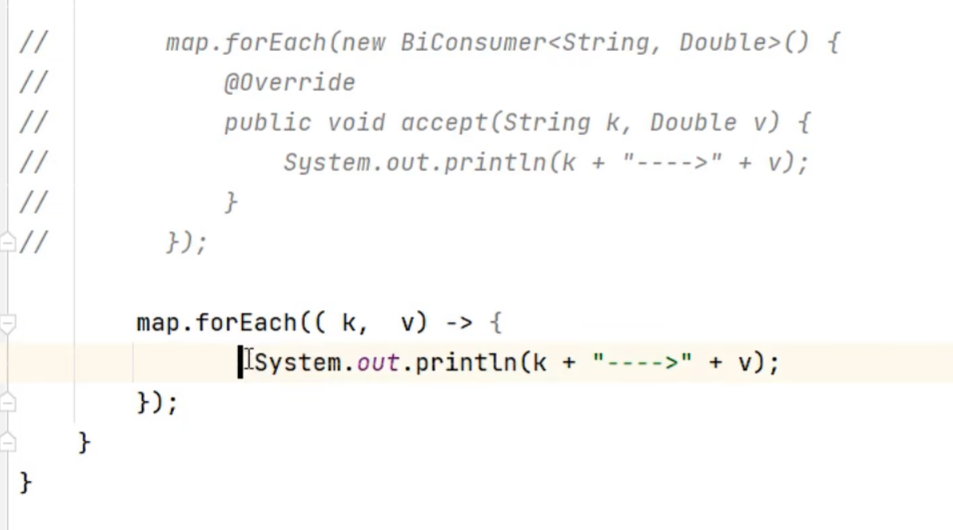

## HashMap

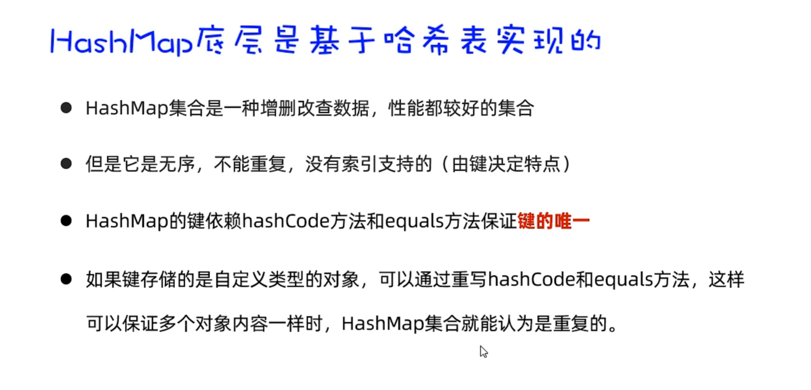

### HashMap底层原理

## LinkedHashMap

### LinkedHashMap底层原理

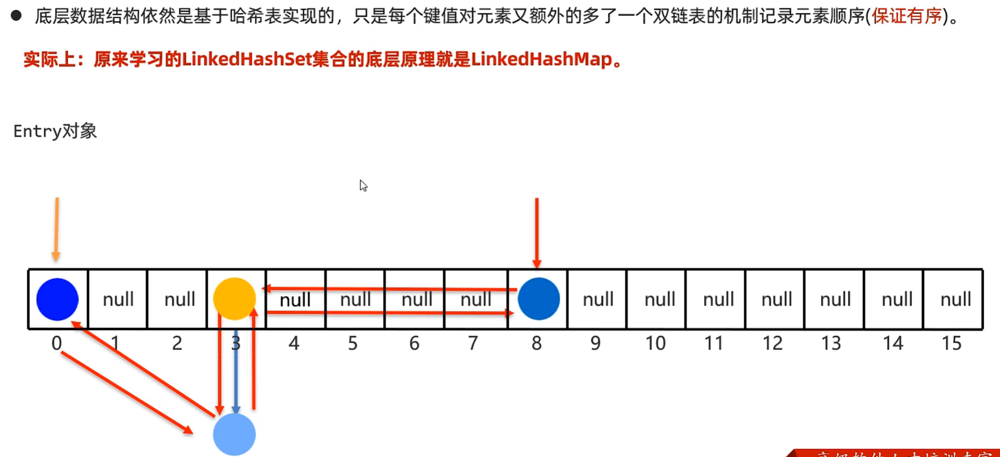

## TreeMap

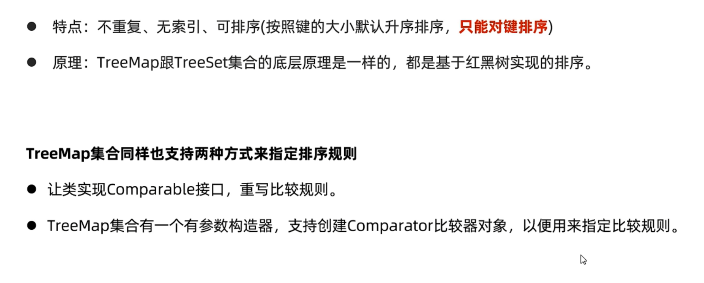

## 集合的嵌套

指集合中的元素又是另一个集合

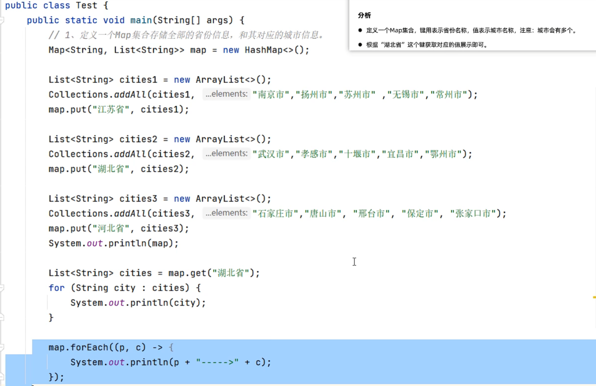

