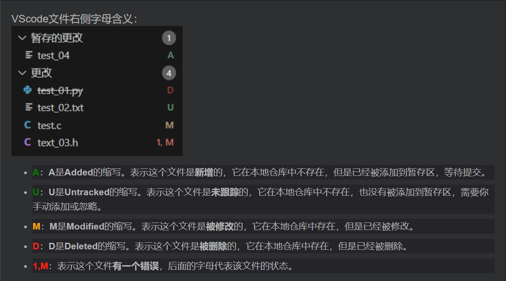

## 版本回退
>在cmd中，版本回退不能使用HEAD^而应当使用HEAD~a（a表示想要回退到的版本），否则会出现more
---
##将修改后的文件提交至**版本库**当中
>1. 首先使用**git add**命令将文件修改提交至暂存区当中
>2. 使用 **git commit**命令将暂存区的 **所有内容**提交到版本库中
>3. 每次修改，如果不用**git add**到暂存区，那就不会加入到**commit**中
---
>需要提交的文件修改通通放到暂存区，然后，一次性提交暂存区的所有修改
---
## 撤销修改
>使用**git checkout -- file**可以丢弃工作区的修改

如：
>git checkout -- readme.txt

>命令git checkout -- readme.txt意思就是，把readme.txt文件在工作区的修改全部撤销，这里有两种情况：
>一种是readme.txt自修改后还没有被放到暂存区，现在，撤销修改就回到和版本库一模一样的状态；
>一种是readme.txt已经添加到暂存区后，又作了修改，现在，撤销修改就回到添加到暂存区后的状态。
---
## 删除文件
1. 使用**rm file**或鼠标右键删除文件
2. 此时有两种选择：
   1. 一是确实要从版本库中删除该文件，那就用命令**git rm**删掉，并且**git commit**
   2. 另一种情况是删错了，因为版本库里还有呢，所以可以很轻松地把误删的文件恢复到最新版本：**git checkout -- file**

>git checkout其实是用版本库里的版本替换工作区的版本，无论工作区是修改还是删除，都可以“一键还原”。

==从来没有被添加到版本库就被删除的文件，是无法恢复的！==
---

---
参考文档:[廖雪峰的git教程](https://www.liaoxuefeng.com/wiki/896043488029600)