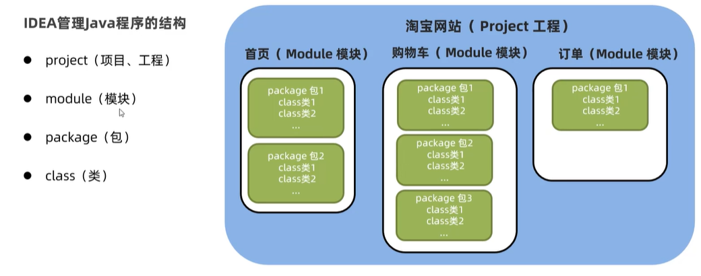

# 使用IDEA创建Java程序

---
**使用idea创建Java程序：**
>1. 创建==项目==new project
**不同的项目之间的资源是不共享的**

>2. 创建==模块==new module

>3. 创建==包==new Package

1. 一个包下面的资源都是共享的（除非是private），不同包下的资源相互使用的时候，需要引入包
2. 包的命名可以用.号分隔，一般公司命名为“com.公司名.项目名.模块名....”，个人可用“pers.个人名.项目名.模块名.……”
3. idea会将每个.分成不同的文件夹存入电脑中
4. 在src中创建包

>4. 创建==类==
类名需满足驼峰原则

>5. 编写代码并启动

右键run即可

---
out中存放编译好的class文件
