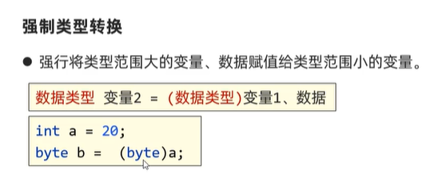

# 类型转换
## 自动类型转换
>类型范围小的变量，可以**直接赋值**给类型范围大的变量

## 表达式的自动类型转换
>在表达式中，小范围类型的变量会自动转换成表达式中**最大范围**的类型，再参与运算

>==表达式的最终结果类型由表达式中的最高类型决定，且在表达式中，byte、short、char是直接转换成int类型参与运算的==

---
>如果两个整数做除法，其结果一定是整数，因为最高类型为整数
---

## 强制类型转换
>类型范围大的变量，直接赋值给类型范围小的变量时，**会报错**

>因此需要使用强制类型转换

## 注意事项
>**小数强转时是直接截断小数保留整数**