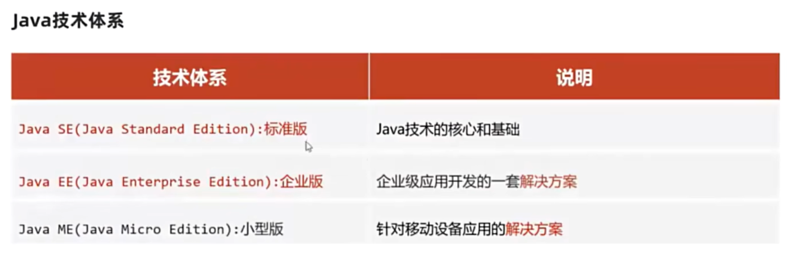
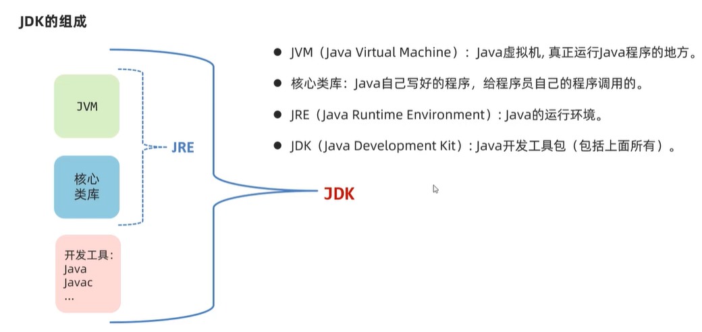
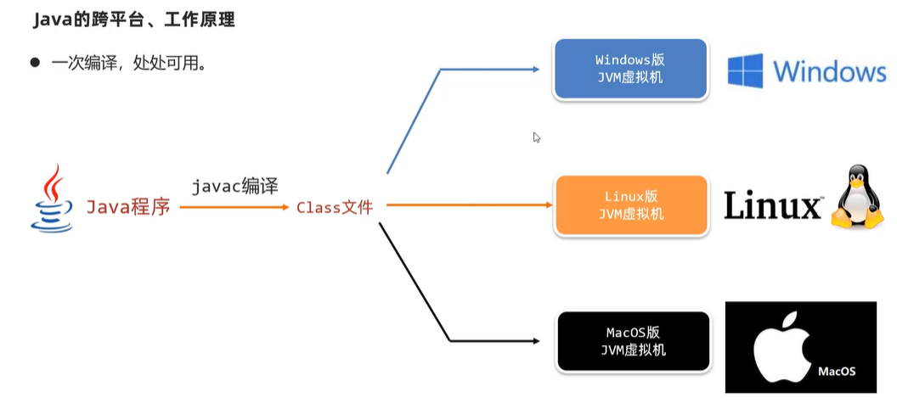

#p2
---
Java有哪些技术平台？


---
#p3
---
**LTS：**
>Long-term support 长期支持版

>JDK8,11,17为LTS版本
---
**JDK中最重要的2个命令程序是什么？各自的作用是？**
>javac、java

>编译工具，执行工具
---
#p4
---
**dir：**
>查看当前路径下的文件信息
---
#p5
---
**Java程序开发的三个步骤：**
>1. 编写一个.java后缀的**源代码文件**
>2. 使用javac对源代码文件进行编译，并生成一个.class后缀的**字节码文件**
>3. 使用java运行
>**源代码文件名需满足驼峰模式，即类似于HelloWorld**
---
**第一个java程序代码HelloWorld.java：**
*需确保类名和文件名相同*
```java
public class HelloWorld{
    public static void main(String[] args){
        System.out.printn("Hello World");
    }
}
```
---
#p8
---
**JDK的组成？**
>JDK由JRE和各种开发工具（如Java，Javac）组成，JRE由JVM和核心类库组成。

>JVM指java虚拟机，是真正运行java程序的地方。


---
**Java的跨平台？**
>一次编译，处处可用

>通过javac编译生成的class文件可在不同操作系统的JVM虚拟机上运行


---

#p9
---
**Path环境变量：**
>用于记住程序路径，方便用户可在计算机的任意地方启动一个程序
---
