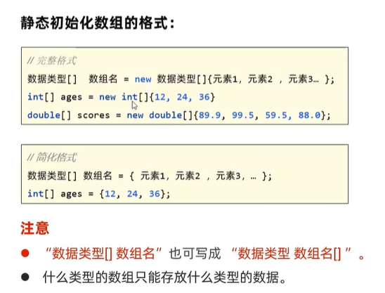
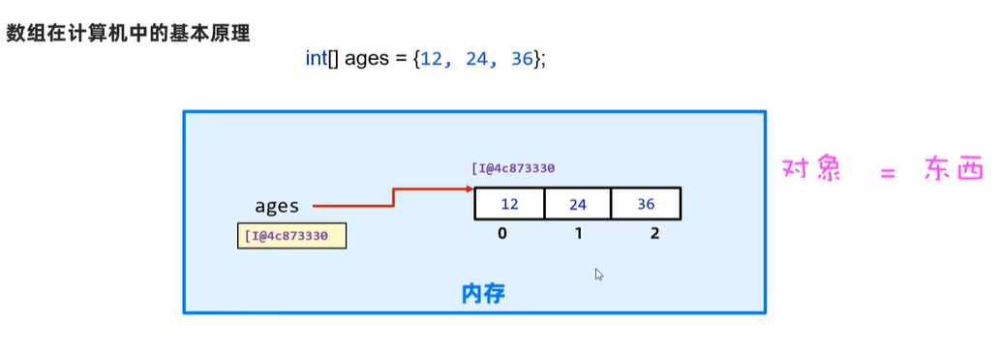
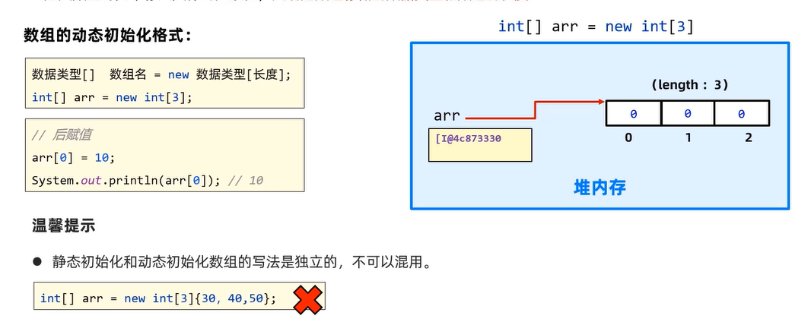
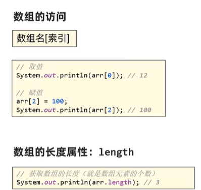

# Java数组

## 静态初始化数组
### 静态初始化数组的方法

>1. int[] ages = new int[]{12,24,36};
>2. int[] ages = {12,24,36};
>3. int ages[] = {12,24,36};

### 数组在计算机中的静态存储

>首先会在内存中开辟**两块**空间，一块为数组名对应的空间，一块为数据存放的空间。
---
>数组名不直接存放数据，而是**存放数据在空间中对应的首地址**，因此数组被称为*引用数据类型*。
---
## 动态初始化数组
### 动态初始化数组的方法

先确定数组存储的**数据类型和长度**：
> int[] arr = new int[3];
再赋值
>arr[0] = 10;

### 数组在计算机中的动态存储
>与静态存储数组大致相同，不同的是动态存储数组在数据空间中只放置各类型初始时的默认大小，如int[3]中只放了3个0

### 各类型初始时的默认大小：

## 数组的访问

>访问数组中的数据时，首先根据数组名对应的地址找到数据存放的位置，接着根据**索引**找到具体的数据

## IDEA中数组的遍历
在IDEA中，可使用快捷键遍历数组：
>ages.fori
接着打印数组：
>ages[i].sout