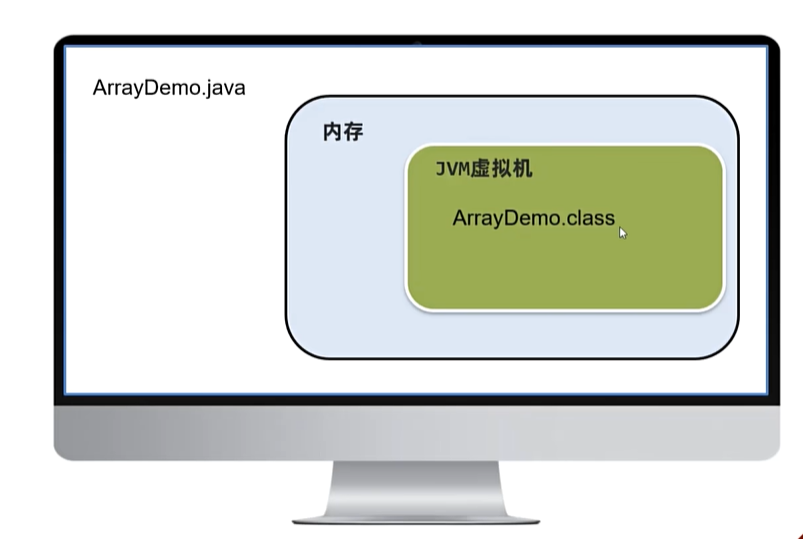
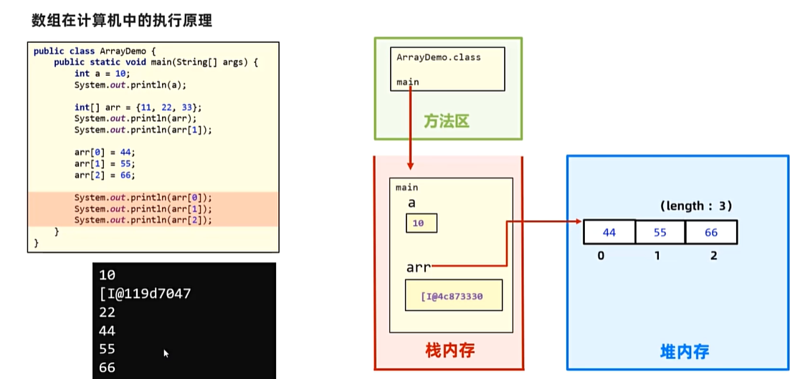
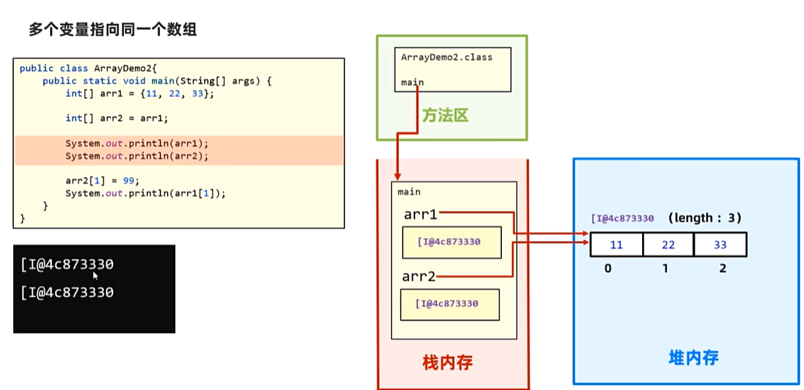

# Java中数组的内存执行原理
>.java文件被编译后，会生成一个.class文件，它将在内存中正在运行的JVM虚拟机中执行


JVM虚拟机中的内存被分为了不同的区域：
* **方法区**

* **栈内存**

* **堆内存**

* 本地方法栈

* 程序计数器


其中：
* 方法区：字节码文件（即class文件）先加载到这里

* 栈内存：方法（如main方法）运行时所进入的内存，变量也是在这里

* 堆内存：new出来的东西会在这块内存中开辟空间并产生地址

>**引用数据类型一般存储在堆内存中，基本数据类型一般存储在栈内存中** 


## 简单说说int a = 20; int[] arr = new int [3];这两行代码的执行原理?

a是变量，直接放在栈内存中，a变量中存储的数据就是20这个值

new int[3]是创建一个数组对象，会在堆内存中开辟区域存储三个整数

arr是变量，直接放在栈内存中，arr变量中存储的数据时数组对象**在堆内存中的地址值**



## 多变量指向同一数组

当执行下列代码时：
```java
int[] arr1 = {11,22,33};
int [] arr2 = arr1;
```
此时，arr1和arr2的输出都为
>[I@4c873330

说明arr1只是存储了**数组对象的地址**在变量中，而赋值操作只是**将arr1中存放的地址复制到arr2中**，因此现在arr2也指向堆地址中的{11,22,33}这个数组对象



>将arr2 = null，则该变量将不再指向任何数组对象