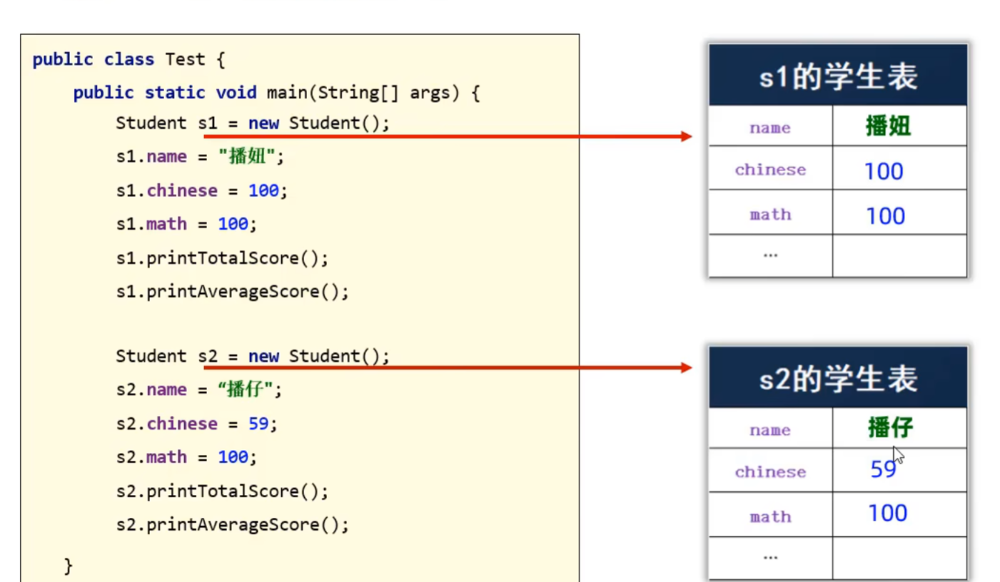
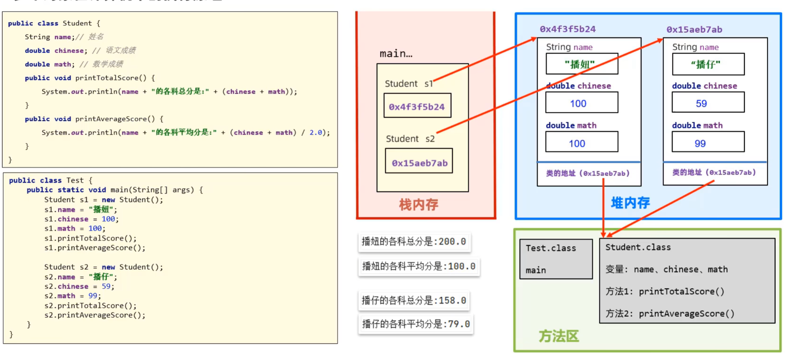
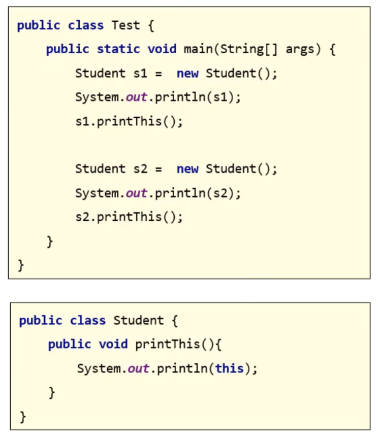
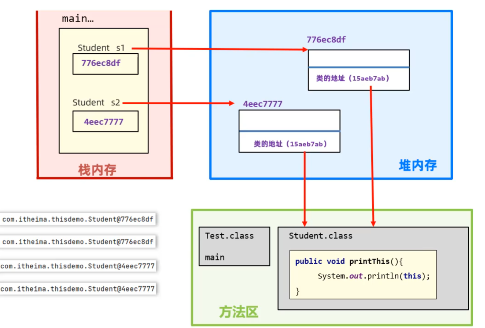

# 面向对象编程

## 对象的本质

对象本质上是**一种特殊的数据结构**

>实际上为一张表

class类，也被称为对象的设计图（或者对象的模板）

>先用class设计出对象，接着需要new出对象，new了多少个对象就有多少个表

## 对象在计算机中的执行原理

如图所示

* 方法区：存入main方法、Test类、Student类，且方法1和方法2都在方法区中的Student类内
* 栈内存：main方法运行时进入，开辟一块内存空间存入变量s1，存放**堆内存中对应的Student对象的地址信息**
* 堆内存：开辟一块内存空间用来存放new出来的Student对象对应的**表**，且其中包含类的地址信息，用来指向**方法区中对应的Student类**

>每次new Student()，就是在堆内存中开辟一块内存区域，代表一个学生对象

## 引用类型变量

形如 Studen s1 = new Student();中的s1，因为s1变量中存储的是对象的地址，因此变量s1也称为引用类型的变量。故：

>引用数据类型一般存储在堆内存中，基本数据类型一般存储在栈内存中

## 类与对象的一些注意事项

* 成员变量：类中定义的变量（也被称为对象的属性）

>成员变量本身存在默认值，在定义成员变量时一般不需要赋初始值

* 成员方法：类中定义的方法（也被称为对象的行为）

* 一个代码文件中，可以写多个class类，但是只能有一个public修饰
>且public修饰的类名必须成为代码文件名

* 但堆内存中的对象，没有被任何变量引用（指向）时，就会被判定为内存中的“垃圾”。
>Java中存在自动垃圾回收机制，会自动清除掉垃圾对象，程序员不用操心

## this

this就是一个变量，可以用在方法中，**来拿到当前对象**

如下列程序：

输出结果为：

>JAVA_First@776ec8df
>JAVA_First@776ec8df
>JAVA_First@4eec7777
>JAVA_First@4eec7777

可见在Student类中的this指的是堆内存中的Student对象，即表。而s1和s2是两个不同的变量，存储的是两个不同的堆内存对象地址。

