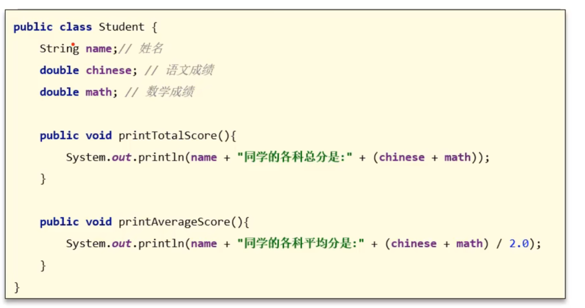
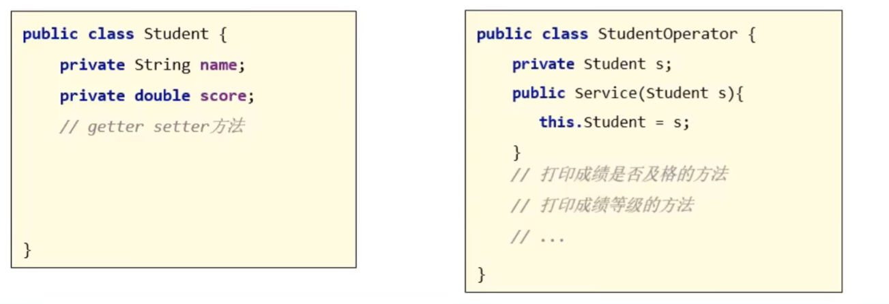

# 面向对象编程2

>面向对象的三大特征：封装、继承、多态

## 构造器

形如下图即为构造器


### 构造器有什么特点

创建对象时，对象会去调用构造器

```java
Student s = new Student();
```

### 构造器的常见应用场景

创建对象时，同时完成对对象成员变量（属性）的初始化赋值

### 注意事项

* 类在设计时，如果不写构造器，Java是会为类自动生成一个无参构造器的

* 一旦定义了有参构造器，Java就不会帮我们的类自动生成无参构造器了，此时就**建议自己手写一个无参构造器出来**

>不然当正常实例化对象时，即如下所示时，会报错
```java
Student s = new Student();
```

## 封装

### 什么是封装

就是用类设计对象处理一个事物的数据时，应该把要处理的数据，以及处理这些数据的方法，设计到一个对象中去。如下图代码：



### 如何做到合理暴露、合理隐藏

合理使用private和public，当使用private修饰变量时，只能在类的内部使用该变量，当使用public修饰时，可在外部使用该变量

---

可自己定义一个setScore方法和getScore方法，当需要对Student类里面的score变量进行修改和访问时，只需要调用setScore方法和getScore方法，如：
```java
s1.setScore(99);//设立score的值为99
System.out.println(s1.getScore());//输出score的值
```
从而不用直接对score的值进行修改：
```java
s1.score = 99;
System.out.println(s1.score);
```
可在方法内加入判断条件，避免因为用户录入的数据不符合规范而导致程序错误。

---

## 实体类

是一种特殊形式的类：

* 这个类中的成员变量都要私有，并且要对外提供相应的getXXX方法，setXXX方法
* 类中必须要有一个公共的无参的构造器
* 可在类中使用有参数构造器，用来对对象成员变量（属性）的初始化赋值

>在idea中，可鼠标右键选择generate（生成），快速在方法中写出get、set和构造器

### 实体类有什么应用场景

实体类只负责**数据存储**，而对数据的处理交给其他类来完成，以实现**数据和数据业务的处理相分离**

如下图：


使用StudentOperator类作为操作类（操作类非强制要求有公共的无参构造器），在主程序中使用时，使用有参构造器，将Student对象传入操作类中，接着可调用各种该类中的方法