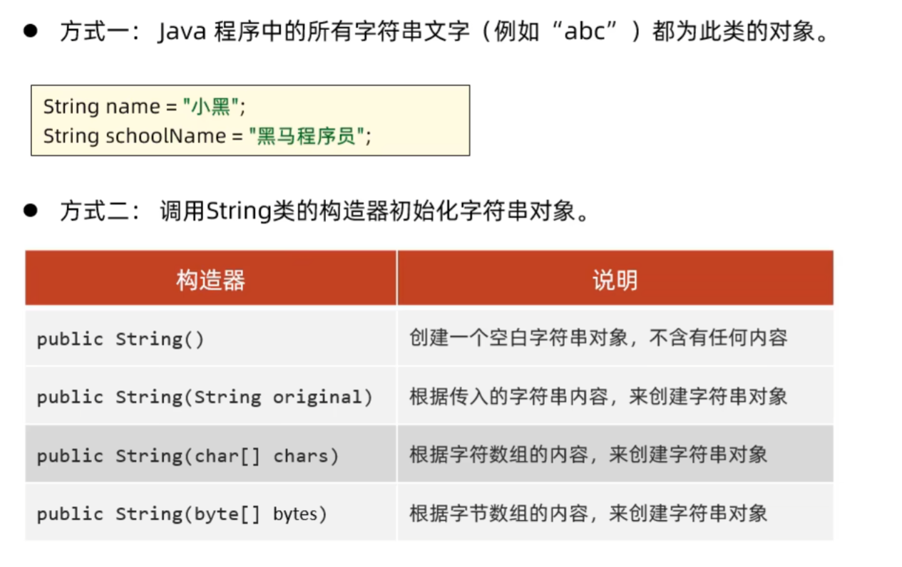
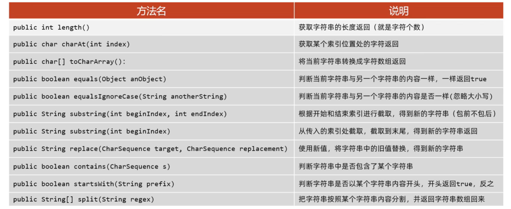
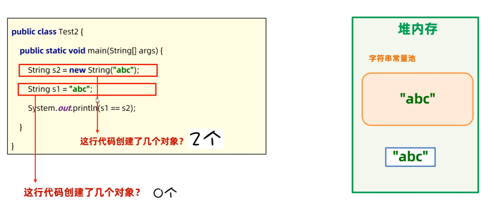
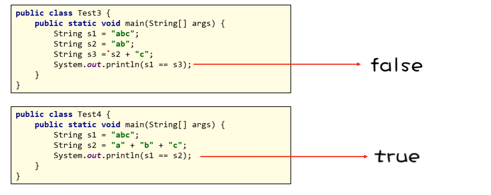

# 常用API

## String

String代表字符串，可以用来创建对象封装字符串数据，并对其进行处理

### String封装字符串的方式



```java
//1.
String name = "abc";
//2.
String rs1 = new String();
//3.
String rs2 = new String("abc");
//4.
char[] chars = {'a', 'b', 'c'};
String rs3 = new String(chars);
//5.
byte[] bytes = {97,98,99}
String rs4 = new String(bytes);
```

其中，1和3的方法一样，2不输出任何东西，5根据acsll码值输出abc

### String常用方法



* public boolean equals(Object anObject)可用来判断两个字符串内容是否相同，而使用"=="则是用来**判断两个变量的地址是否相同**

### String注意事项

1. String对象的内容不可改变，被称为**不可变字符串对象**
>因为Java设定只要是以""（双引号）方式写出的字符串对象，会在**堆内存的字符串常量池**中存储
如下列程序：
```java
String name = "a";
name += "b";
name += "c";
```
尽管name变量变了三次，但是实际上每一次都是创建了一个新的字符串，变成了"a","ab","abc"三个字符串对象，
"a"存储在堆内存的字符串常量池中，而"b"和"c"存储在堆内存中（**因为b和c是通过运算得来的**），name变量每一次改变的只是堆内存对应的地址
>这样做可以**节约内存**，因为对于需要多次使用的字符串，只需创建一次便可以多次使用

2. 通过new方式创建的字符串对象，每new一次都会产生一个新的对象放在堆内存中
>因此使用"=="对于两个new方式建立的字符串对象，无法比较内容是否相同，正确方式为使用public boolean equals(Object anObject)

### 问题



由于"abc"本身就会在堆内存的字符串常量池中创建一个对象，而new又会创建一个，故第一行有两个；
而由于在堆内存的字符串常量池中已经有了"abc"，故第二行代码不会再创建新的对象，而是继续使用该字符串对象



* 只要是运算得出的字符串都存在堆内存中，""得到的字符串存在堆内存的字符串常量池中
* Java存在编译优化机制，程序在编译时，"a"+"b"+"c"会直接转成"abc"，以**提高程序的执行性能**