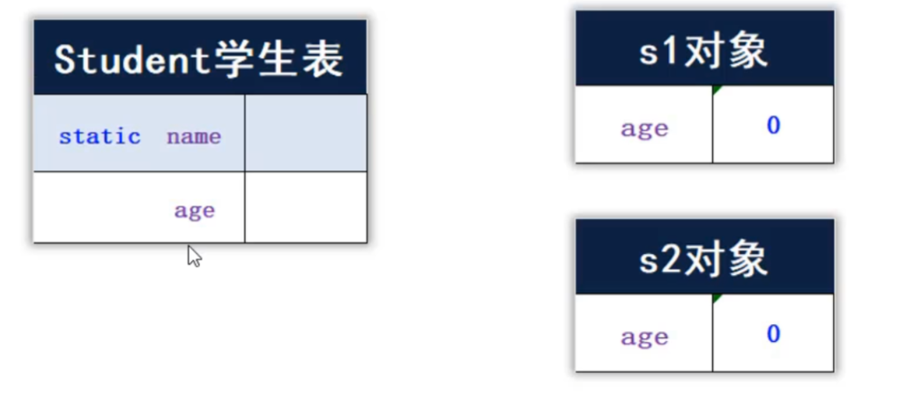
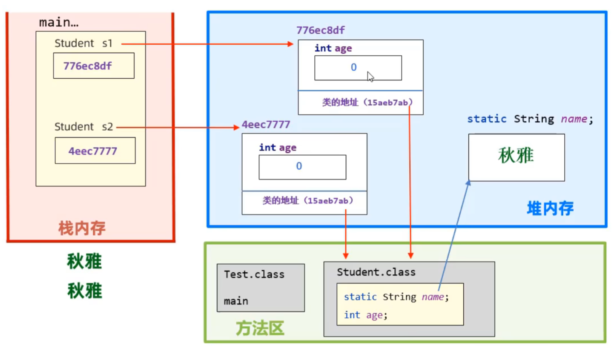
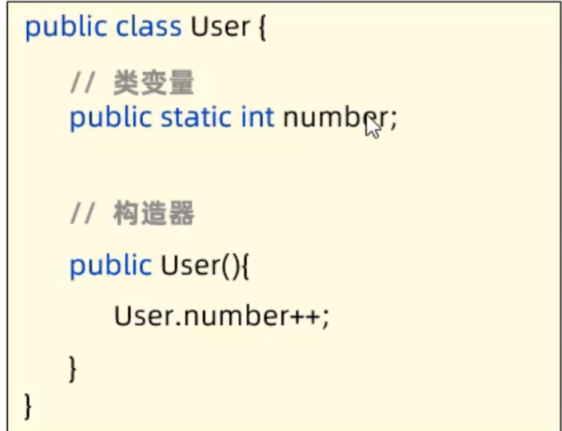
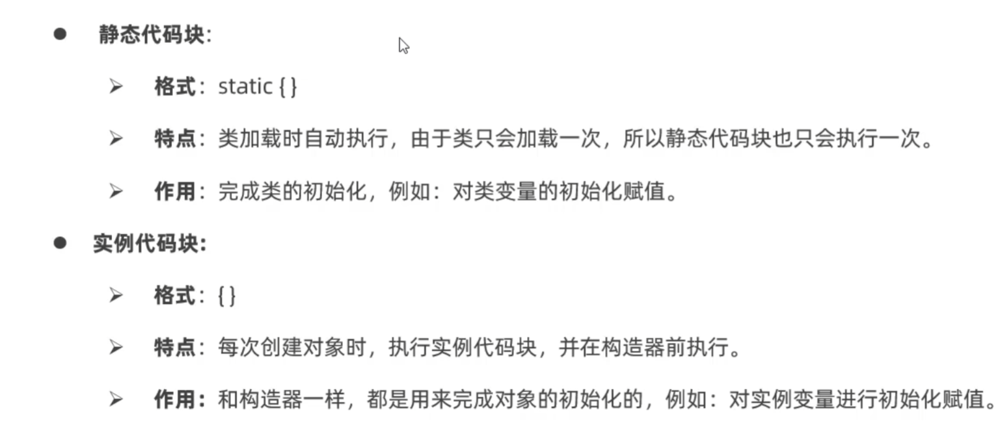
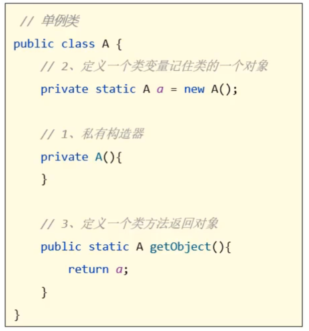
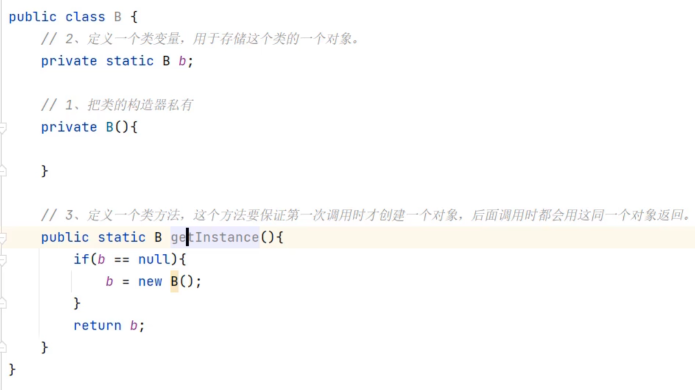

# static

静态，可以修饰成员变量，成员方法

成员变量按照有无static修饰分为两种：

* 类变量：有static修饰，属于类，在计算机中只有一份，**会被类的全部对象共享**
* 实例变量（对象的变量）:无static修饰，属于每个对象

如下列代码中，name为类变量，age为实例变量

```java
public class Student{
    static String name;
    int age;
}
```

如下图：



Student创建了两个对象s1和s2后，它们各自会有一个变量age，但是没有name变量，要想使用name只能通过访问Student类使用

>类变量被创建在堆内存中



## static的使用

* 类变量，类方法（静态方法）
类名.类变量
类名.类方法

* 实例变量，实例方法
对象.实例变量
对象.实例方法

## 类变量的应用场景

在开发中，如果某个数据只需要一份，且希望能够被共享（访问、修改），则该数据可以定义成类变量来记住

>访问自己类中的类变量时，可以省略类名不写



代码中的User.number++可以直接写成number++

## 类方法的应用场景

做工具类

### 工具类

工具类中的方法**都是一些类方法**，每个方法都是用来完成一个功能的，工具类是给开发人员共同使用的

### 为什么工具类的方法只用类方法，不用实例方法？

* 实例方法需要创建对象使用，而此时对象只是用来调用方法，因此对象此时占用内存，会造成内存浪费
* 类方法直接用类名调用即可

>工具类没有创建对象的需求，因此建议将工具类的构造器私有

## static的注意事项

1. 类方法中可以直接访问类的成员，不可以直接访问实例成员
   
>因为实例成员是对象的成员，而调用类方法不需要定义对象

2. 实例方法中既可以访问类成员，也可以直接访问实例成员
3. 实例方法中可以出现this关键字，类方法中不可以出现this关键字
   
>因为this指的是当前对象，而调用类方法不需要定义对象

## 代码块



## 单例设计模式

确保一个类只有一个对象

步骤：
* 把类的构造器私有
* 定义一个类变量记住类的一个对象
* 定义一个类方法，返回对象

饿汉式：



### 单例设计模式的应用场景

可以避免浪费内存（只需要一个对象，没必要创建多个对象）

### 饿汉式和懒汉式单例设计模式

* 饿汉式：在类加载的时候就完成实例化
* 懒汉式：使用对象时，才开始创建对象（延迟加载对象）

懒汉式：



>当需经常使用某单例对象时，用饿汉式；当偶尔使用时，用懒汉式